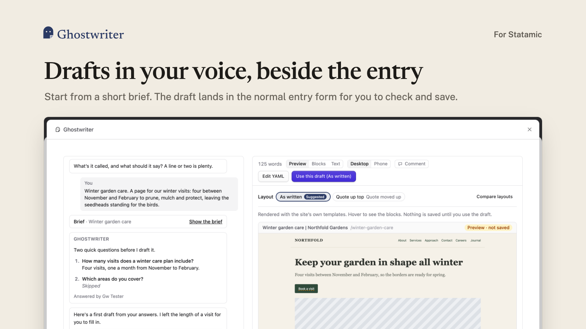
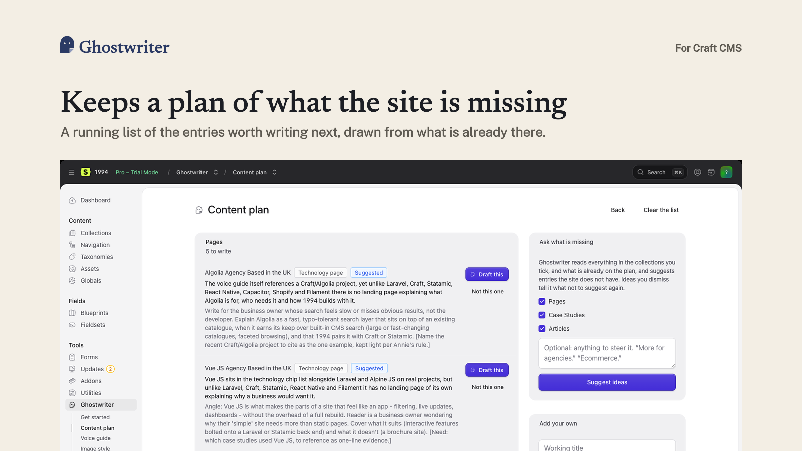
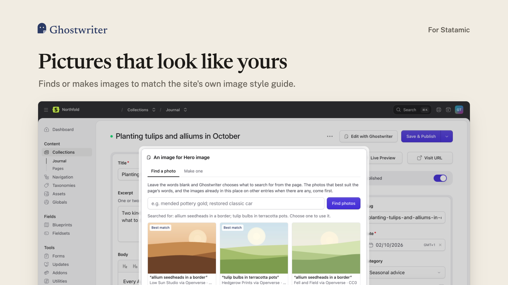

<p align="center">
  <picture>
    <source media="(prefers-color-scheme: dark)" srcset="docs/logo-dark.png">
    
  </picture>
</p>

<p align="center">A Statamic 6 addon that learns how a site writes and what its pictures look like, then drafts new entries in that voice from a short brief and a conversation, on the entry's own create screen.</p>

<p align="center">
  
</p>

It works on any collection because it takes its instructions from the collection's blueprint and the entries already in it. It runs on Claude, ChatGPT or Gemini, with your own API key, and nothing it writes is published for you: every draft goes into the normal entry form for a person to check and save.

## What it does

- **Voice guide.** Reads a sample of your published entries and writes a tone of voice guide: who is talking and to whom, how pieces are shaped, the words you use and the ones you never do. A markdown file in your project, edited in the Control Panel or refined by asking for a change.
- **Image style.** Looks at the images your entries use and writes down the house style, a section per collection, so the photographs it finds and the pictures it makes belong beside them.
- **Kinds of content.** Looks over each collection and suggests the kinds of content in it (a case study, a service page, a press release), each learned with a click into a brief of its own. A general brief works on every collection with no setup at all.
- **Writing.** *Write with Ghostwriter* on a create screen opens a panel beside the form. Give it a title and a few notes and the brief fills itself in; check it, answer anything it still needs, and the draft appears. Ask for changes in conversation, click any piece of writing to edit it in place, then *Use this draft* fills in the form.
- **Editing.** *Edit with Ghostwriter* on an existing entry starts from the entry as its form holds it, unsaved typing included. Only the writing changes; images, links, chosen entries, settings and block IDs stay as they are in the form.
- **House style.** A new entry takes what the model entries agree on place by place: the settings and links where each block sits, how many nested items (such as breadcrumbs) and of which types, and how rich text is dressed. Where an image belongs but none is chosen yet, a striped placeholder marks the spot.
- **Images.** A Ghostwriter button on every assets field: find a free photograph (searches chosen from the words around the field, ranked against the pictures already in that place), or have one made in that style. The image goes straight into the field.
- **Content plan.** Ghostwriter reads the whole site and suggests entries it is missing. Keep the good ones; each opens a new entry with its brief filled in.
- **Get started.** Seven steps from installed to writing, done from one page, with a card on the dashboard and a Control Panel widget.

<p align="center">
  
  
</p>

The writer is told to use only facts from the brief and the conversation. It does not invent figures, quotes, client names or results; what it does not know it asks for, or writes around.

Full documentation is in [docs/](docs/README.md): [installation](docs/installation.md), [API keys](docs/api-keys.md), [getting started](docs/getting-started.md), [writing](docs/writing.md), [editing](docs/editing.md), [kinds](docs/kinds.md), [guides](docs/guides.md), [images](docs/images.md), [the content plan](docs/content-plan.md), [the dashboard](docs/dashboard.md), [configuration](docs/configuration.md), [fields](docs/fields.md), [privacy](docs/privacy.md) and [troubleshooting](docs/troubleshooting.md).

## Requirements

- Statamic 6
- PHP 8.3+, with GD (for placeholders); Imagick is optional, for sending smaller copies of images to the model
- An API key for Anthropic, OpenAI or Gemini
- A queue connection, or PHP-FPM (see "The queue" below)

## Installation

```bash
composer require 1994/ghostwriter-statamic
```

Add your key to `.env`:

```
ANTHROPIC_API_KEY=your-key
```

Then open **Tools → Ghostwriter → Get started** in the Control Panel.

## API keys

Keys are read from `.env` each time one is needed. None is ever stored by Ghostwriter.

| Key | For | Needed |
| --- | --- | --- |
| `ANTHROPIC_API_KEY` | Writing, briefs, kinds, the plan, ranking photographs (Claude) | One of these three |
| `OPENAI_API_KEY` | The same with ChatGPT; also making images | |
| `GEMINI_API_KEY` | The same with Gemini; also making images | |
| `UNSPLASH_ACCESS_KEY` | Finding photographs on Unsplash (free key) | Optional |
| `PIXABAY_API_KEY` | Finding photographs on Pixabay (free key) | Optional |
| `PEXELS_API_KEY` | Finding photographs on Pexels | Optional |

Openverse (public-domain and CC0 work) is searched with no key at all. Claude cannot make images; with only an Anthropic key, images are found, not made.

## Setting up

The **Get started** page walks through it. In short:

1. **Settings** (under Ghostwriter in the navigation): the collections to write for, the collections to read for the voice, the provider and model.
2. **Voice guide**: generate it, read it, correct it.
3. **Kinds**: on the dashboard, learn the kinds Ghostwriter suggests for each collection, or *Teach a kind* by hand.
4. **Image style** (optional): generate it from your images.
5. **Content plan** (optional): ask what is missing.
6. Write something.

## Permissions

Users need **Write content and edit the voice guide with Ghostwriter**. Beyond that, Ghostwriter never does what the person could not do by hand: putting a draft into an entry needs their permission to create entries in that collection (or edit that entry), and saving an image into an assets field needs their permission to upload to its container. Conversations belong to whoever started them; nobody else sees or opens them, super users aside. Only someone who may edit the addon's settings sees them.

## The queue

Model calls take a minute or more, longer than a web request should be held open. With a real queue connection they run as queued jobs. On the `sync` driver, the default for a flat-file site, they run after the HTTP response has been sent, in the same PHP process, while the screen polls for the result. This needs PHP-FPM (Herd, Forge and most hosts); the single-threaded `php artisan serve` will block.

## Configuration

Most settings can be chosen on the settings screen or in `config/ghostwriter.php` (and `.env`). A value set in the config wins, and the settings screen shows that field locked. Publish the config with:

```bash
php artisan vendor:publish --tag=ghostwriter-config
```

| Setting | Where | Default |
| --- | --- | --- |
| Provider and model | Settings screen, or `provider` / `model` | `anthropic`, the provider's default model |
| Collections to write for | Settings screen, or `collections` | All |
| Collections read for the voice | Settings screen, or `voice.collections` | All |
| Suggest kinds automatically | Settings screen, or `suggest_kinds` | On |
| Mark images still to choose (striped placeholders) | Settings screen, or `images.placeholders` | On |
| Image provider and model | Settings screen, or `images.provider` / `images.model` | Whichever has a key |
| Openverse | `images.openverse` | On |
| Show Get started | Settings screen (acts on Ghostwriter's own state; not stored) | |
| Timeout per model call | `timeout` | 300 seconds |

The dashboard widget is added in `config/statamic/cp.php`:

```php
'widgets' => [
    ['type' => 'ghostwriter', 'limit' => 5],
],
```

## Where things are kept

| What | Where | Versioned |
| --- | --- | --- |
| Voice guide | `resources/ghostwriter/voice.md` | Yes |
| Image style guide | `resources/ghostwriter/imagery.md` | Yes |
| Content types (kinds) | `resources/ghostwriter/types/*.yaml` | Yes |
| Content plan | `resources/ghostwriter/ideas.yaml` | Yes |
| Settings | `resources/addons/ghostwriter-statamic.yaml` | Yes |
| Sessions, suggestions, image requests | `storage/ghostwriter/` | No |

No database is needed.

## Prompt overrides

The prompts are plain markdown files. Publish them and edit any one per project:

```bash
php artisan vendor:publish --tag=ghostwriter-prompts
```

They land in `resources/ghostwriter/prompts/`; a file there replaces the one Ghostwriter Core ships.

## How fields are read

Every field in a blueprint is reduced to a kind:

| Kind | Fieldtypes | The writer produces |
| --- | --- | --- |
| text, long text | text, textarea, color | plain strings |
| rich text | bard, markdown | markdown, converted to a Bard document where the field is Bard |
| choice | select, radio, button group, checkboxes; an assets field limited to one small folder | one of the field's options |
| toggle, number, list | toggle, integer, float, list, taggable | the value |
| blocks | replicator | a list of sets, each with its own fields |
| rows, group | grid, group | nested fields |
| reference | assets, entries, users, terms, link, date and others | nothing; left for a person, a placeholder or the house style |

From existing entries it learns, per replicator field, the usual order of sets, how often each is used, which fields are ever filled in, and which values are the same on nearly every entry; blocks identical everywhere (process steps, testimonials) are copied rather than written. The house style adds what the entries agree on by position.

## What is sent to providers

- To the text provider: the voice guide, the content type's brief and guidance, the blueprint's fields, one or two existing entries as examples, and the conversation. For the image style guide and photo ranking: small copies of the images concerned. For kind suggestions and the plan: entry titles, how entries are built and how they open.
- To the image provider: the prompt and up to three reference images from your site, plus any source image you supply.
- To photo libraries: the search terms only.

Nothing is sent until someone asks for it.

## Developing

`package.json` takes Statamic's UI package from `vendor/statamic/cms`, so Composer has to run before npm on a fresh clone, in this order:

```bash
composer install
npm ci
npm run build        # builds resources/dist, which is committed
vendor/bin/phpunit
```

Tests fake every model call and HTTP request, so they need no API key. The installed package carries only what runs (`.gitattributes` keeps the docs, scripts, tests and frontend sources out of the Composer download). In a site using the addon, after a build: `php artisan vendor:publish --tag=ghostwriter-statamic --force`.

Marketplace screenshots are taken from the real product with `php scripts/screenshots.php` (see the script for what it needs), then set in the brand frames with `scripts/frame.php`. `scripts/promo.php` records a short promo video the same way; it needs `ffmpeg` to encode the result.
