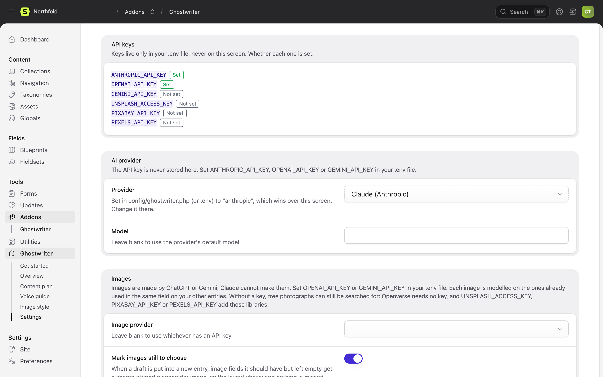
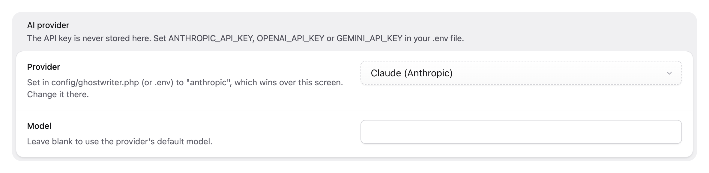

# Configuration

This page covers the settings screen, `config/ghostwriter.php`, where Ghostwriter keeps things, overriding its prompts, and logging.

## Settings

**Ghostwriter → Settings** (`/cp/addons/ghostwriter-statamic/settings`), for [managers](permissions.md#managing-ghostwriter) only:



| Setting | What it does |
| --- | --- |
| **Write for these collections** | Collections that get **Write with Ghostwriter**. Empty means all. |
| **Learn the voice from these collections** | Collections read for the voice guide. Empty means all. |
| **Show Get started** | Brings Get started back after it was hidden. It acts when you save, and isn't stored. |
| **Suggest kinds of content** | Whether Get started looks over each collection for kinds by itself. Elsewhere kinds are only suggested on a click. |
| **API keys** | Each key Ghostwriter can use, shown as **Set** or **Not set**. Keys live in `.env` only. |
| **Provider** | Claude (Anthropic), ChatGPT (OpenAI) or Gemini (Google), for writing. |
| **Model** | Blank for the provider's default. A model name that belongs to another provider ("gpt-…" with Claude chosen, say) is saved with a warning. |
| **Image provider** | ChatGPT (OpenAI) or Gemini (Google), for making images. Blank uses whichever has a key. |
| **Image model** | Blank for the provider's default. |
| **Mark images still to choose** | A striped placeholder in image fields a new entry should have but the draft left empty. See [Placeholders](images.md#placeholders). |
| **Search Openverse** | Search Openverse's public-domain and CC0 photos (no key needed). |

Settings are kept in `resources/addons/ghostwriter-statamic.yaml`. API keys are never set here.

### Settings fixed in config

A value set in `config/ghostwriter.php`, or by its `.env` variable, wins over the settings screen. The field then shows locked, with the config's value and a note: "Set in config/ghostwriter.php (or .env) to "anthropic", which wins over this screen. Change it there." What was saved on the screen is kept, and comes back if you take the value out of the config.



The settings that work this way are `provider`, `model`, `collections`, `voice.collections`, `suggest_kinds`, `images.provider`, `images.model`, `images.placeholders` and `images.openverse`. Leave one `null` (or a list empty) to let the screen decide.

### The time limit

Each model call may take `timeout` seconds, 300 by default. It is set in the config (or `GHOSTWRITER_TIMEOUT`) only, not on the screen. Queued jobs are allowed three times this plus 60 seconds; see [The queue](installation.md#the-queue).

## config/ghostwriter.php

Publish the config to change any of these in code, or per environment:

```bash
php artisan vendor:publish --tag=ghostwriter-config
```

| Key | Default | |
| --- | --- | --- |
| `provider` | `null` (the screen; Claude if that is blank too) | `anthropic`, `openai`, `gemini` or `openrouter` |
| `openrouter.models.writing`, `openrouter.models.quick` | `null` (the screen; then OpenRouter's defaults) | With OpenRouter, the model for each tier. See [OpenRouter](api-keys.md#openrouter) |
| `model` | `null` (the provider's default) | |
| `timeout` | `300` | Seconds to wait for one response |
| `keys.anthropic`, `keys.openai`, `keys.gemini`, `keys.openrouter` | from `.env` | API keys. When one is empty, a key in `config/ai.php` is used, if there is one |
| `base_urls.anthropic`, `base_urls.openai`, `base_urls.gemini`, `base_urls.openrouter` | `null` | A gateway that speaks the provider's API. See [Gateways and proxies](api-keys.md#gateways-and-proxies) |
| `anthropic_fallbacks` | `true` | Pass a request Claude declines to the model Anthropic recommends, on models that support it |
| `log_channel` | `null` (the default channel) | Where each call is logged |
| `debug.log_replies` | `false` | Put the whole reply in the log when it can't be read. See [Seeing what went wrong](troubleshooting.md#seeing-what-went-wrong) |
| `images.provider`, `images.model` | `null` | Making images. `null` provider uses OpenAI, then Gemini, then OpenRouter, whichever has a key |
| `images.unsplash_key`, `images.pexels_key`, `images.pixabay_key` | from `.env` | Photo library keys |
| `images.openverse` | `null` (the screen; on if that is blank) | Search Openverse |
| `images.guide_path` | `resources/ghostwriter/imagery.md` | The image style guide |
| `images.guide_samples` | `10` | Images looked at per collection for the image style guide |
| `images.placeholders` | `null` (the screen; on if that is blank) | Mark images still to choose |
| `voice.path` | `resources/ghostwriter/voice.md` | The voice guide |
| `voice.collections` | `[]` (all) | Collections read for the voice guide |
| `voice.max_entries`, `voice.max_chars_per_entry`, `voice.max_chars` | `24`, `6000`, `90000` | How much is read for the voice guide |
| `collections` | `[]` (all) | Collections to write for |
| `types_path` | `resources/ghostwriter/types` | Kinds of content |
| `suggest_kinds` | `null` (the screen; on if that is blank) | Whether Get started suggests kinds by itself |
| `plan.path` | `resources/ghostwriter/ideas.yaml` | The content plan |
| `plan.suggestions` | `8` | Ideas asked for each time |
| `sessions_path` | `storage/ghostwriter/sessions` | Conversations. The rest of Ghostwriter's working files sit beside this folder |
| `shared_conversations` | `true` | See [Shared conversations](permissions.md#shared-conversations) |
| `stock_path`, `stock.*` | see [Stock photos](stock-photos.md#configuration) | The stock image ledger, paid libraries' keys, the demo library, the publish rule |
| `drafts_unpublished` | `true` | **Use this draft** switches the form's Published toggle off on a new or unpublished entry. See [Use this draft](writing.md#use-this-draft) |
| `writer` | `SchemaEntryWriter::class` | The class that turns a draft into entry data; bind your own to take over |

Environment variables: `GHOSTWRITER_PROVIDER`, `GHOSTWRITER_MODEL`, `GHOSTWRITER_TIMEOUT`, `GHOSTWRITER_ANTHROPIC_BASE_URL`, `GHOSTWRITER_OPENAI_BASE_URL`, `GHOSTWRITER_GEMINI_BASE_URL`, `GHOSTWRITER_OPENROUTER_BASE_URL`, `GHOSTWRITER_OPENROUTER_WRITING_MODEL`, `GHOSTWRITER_OPENROUTER_QUICK_MODEL`, `GHOSTWRITER_ANTHROPIC_FALLBACKS`, `GHOSTWRITER_LOG_CHANNEL`, `GHOSTWRITER_IMAGE_PROVIDER`, `GHOSTWRITER_IMAGE_MODEL`, `GHOSTWRITER_OPENVERSE`, `GHOSTWRITER_PLACEHOLDER_IMAGES`, `GHOSTWRITER_SUGGEST_KINDS`, `GHOSTWRITER_SHARED_CONVERSATIONS`, `GHOSTWRITER_DRAFTS_UNPUBLISHED`, and the keys in [API keys](api-keys.md).

## Where things are kept

Ghostwriter adds no database tables. Everything is a file.

| What | Where | Commit it? |
| --- | --- | --- |
| Voice guide | `resources/ghostwriter/voice.md` | Yes |
| Image style guide | `resources/ghostwriter/imagery.md` | Yes |
| Kinds of content | `resources/ghostwriter/types/*.yaml` | Yes |
| Content plan | `resources/ghostwriter/ideas.yaml` | Yes |
| Prompt overrides | `resources/ghostwriter/prompts/*.md` | Yes |
| Settings | `resources/addons/ghostwriter-statamic.yaml` | Yes |
| Conversations and drafts | `storage/ghostwriter/sessions/` | No |
| Photo searches and made images waiting to be used | `storage/ghostwriter/images/` | No |
| The stock image ledger (one file per stock photo, with its licence) | `content/ghostwriter/stock/*.yaml` | Yes |
| Stock previews (watermarked, private, deleted when their period ends) | `storage/ghostwriter/stock/` | No |
| Your own images uploaded for a picture under a draft | `storage/ghostwriter/uploads/` | No |
| When work was queued (for the "still waiting" notice) | `storage/ghostwriter/queued/` | No |
| The key from Connect with OpenRouter (encrypted) | `storage/ghostwriter/provider-keys.json` | No |
| Whether Get started is hidden | `storage/ghostwriter/onboarding.json` | No |
| Collections already looked over for kinds, and suggested kinds | `storage/ghostwriter/types.json`, `kinds.json` | No |
| How the guides and plan runs stand | `storage/ghostwriter/voice.json`, `imagery.json`, `plan.json` | No |
| Published Control Panel assets | `public/vendor/ghostwriter-statamic/` | No |

The guides, kinds and plan are project files, so they move between environments with your code. If editors change them on production, pull the changes back into your repository.

## Overriding prompts

Every prompt is a markdown file, shipped with Ghostwriter Core in `vendor/1994/ghostwriter-core/resources/prompts/`. Publish them, then edit any one; your copy is used from then on:

```bash
php artisan vendor:publish --tag=ghostwriter-prompts
```

They land in `resources/ghostwriter/prompts/`. Keep any `{{ placeholders }}` that are in the original. `[[placeholders]]`, such as `[[item]]` and `[[group]]`, are filled with Statamic's own words (entry, collection); keep them or write the words in.

| Prompt | Used for |
| --- | --- |
| `writer.md` | Writing and revising drafts |
| `brief-filler.md` | Filling in the brief card from the quick details or a plan idea |
| `voice-analyst.md`, `voice-editor.md` | Writing and changing the voice guide |
| `type-analyst.md` | Learning a kind of content |
| `kind-finder.md` | Suggesting kinds of content |
| `imagery-analyst.md` | Writing the image style guide |
| `planner.md` | Suggesting content plan ideas |
| `photo-researcher.md` | Choosing photo searches for a field |
| `photo-query.md` | A short photo search from a page's title and summary |
| `photo-picker.md` | Choosing the photos that suit the page |
| `image.md` | Making an image |

## Logging

Every model call is logged with the provider, model, tokens and time, never the words sent or received, or the keys. Set `log_channel` (`GHOSTWRITER_LOG_CHANNEL`) to send these lines to their own channel. Errors, and what was wrong with replies that couldn't be read, go to the log too, prefixed "Ghostwriter:". The reply itself is logged only with `debug.log_replies` (`GHOSTWRITER_LOG_REPLIES`) on.

Next: [Writing a new entry](writing.md).
