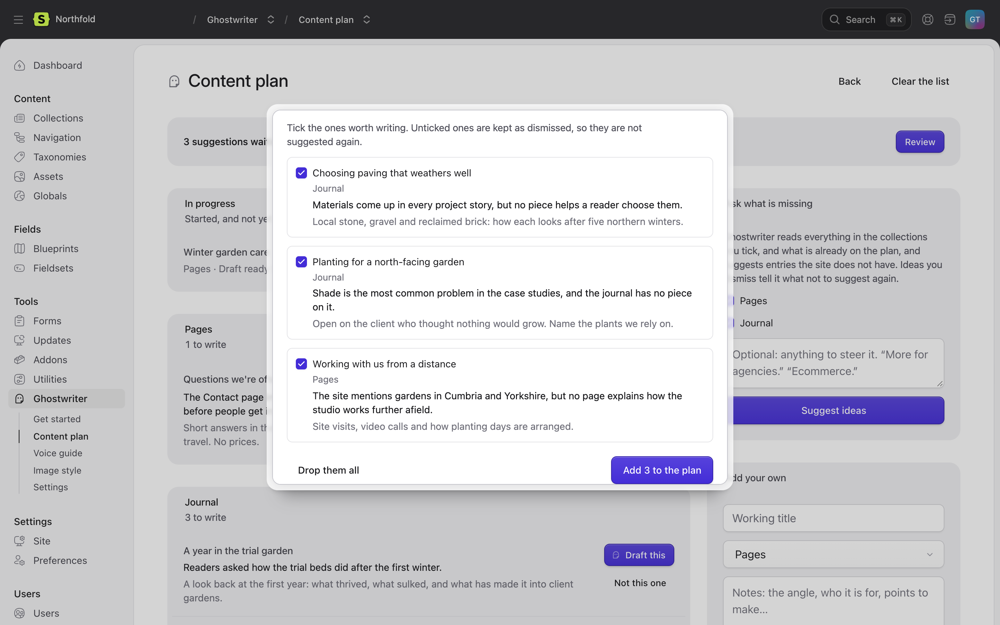
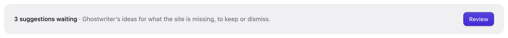
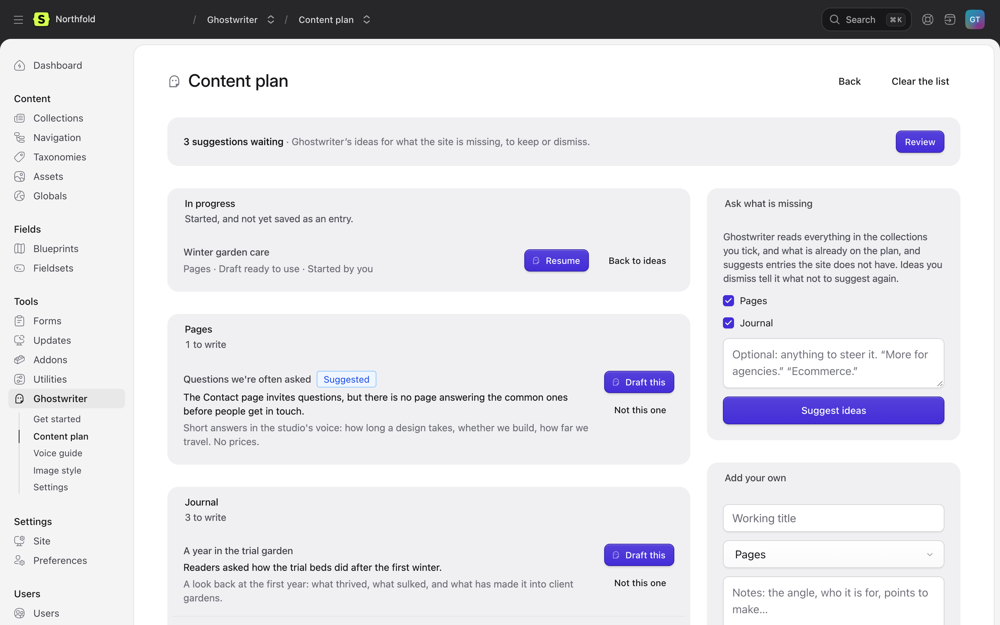

# The content plan

This page covers the content plan: a list of entries worth writing, suggested by Ghostwriter or added by you.

**Ghostwriter → Content plan.** Each idea has a title, why it is worth writing, and notes on the angle, who it is for and what it should say.

## Asking what is missing

Under **Ask what is missing**:

1. Tick the collections to read.
2. Optionally, steer it: "More for agencies."
3. **Suggest ideas.** Ghostwriter reads everything in those collections, and what is already on the plan, and suggests entries the site doesn't have. It takes a minute or so, and asks for `plan.suggestions` ideas (8 by default).

The suggestions open in **Ghostwriter suggests**, all ticked. Untick the ones you don't want, then **Add N to the plan**. Unticked ones are kept as dismissed, so they aren't suggested again. With none ticked, the button reads **Add none, dismiss the rest**. **Drop them all** discards the lot. If there is nothing new, it says "Nothing new to suggest this time."

## Suggestions waiting

Closing **Ghostwriter suggests** (or pressing Esc) keeps the suggestions: they cost a model call. A card at the top of the plan says "N suggestions waiting", and **Review** opens them again. Only **Drop them all** discards them.

## Adding your own

Under **Add your own**, give a **Working title**, choose the collection, and add notes if you like, then **Add to the plan**. Notes feed the brief, so a line or two helps.

## The list

- **In progress** at the top: "Started, and not yet saved as an entry." Each piece shows its stage (**Ghostwriter is writing**, **Waiting on your answers**, **Draft ready to use**, **Put in the form, not saved**), who started it, **Resume** and **Back to ideas**.
- **Ideas**, grouped by collection, the newest first. Ideas Ghostwriter suggested carry a **Suggested** badge. Each has **Draft this** and **Not this one**.
- Finished and dismissed ideas are folded away under **Show N finished and dismissed**. A finished idea links to its entry with **Open entry**. **Put back** returns a dismissed idea to the list; finished ones can't be put back, as that would make a second copy of a piece already written.

## Writing an idea

**Draft this** opens a new entry in that collection with Ghostwriter open, and fills the brief in from the idea (one model call). Starting to write marks the idea as in progress.

A piece counts as finished only once its entry is saved. Put into the form and not saved, it stays in progress. Removing a piece's conversation puts its idea back on the list.

## Tidying up

- **Clear the list** removes every open idea, after asking. Ideas in progress and dismissed ones stay.
- **Delete all dismissed** forgets what was dismissed, so it may be suggested again.

## Where the plan is kept

The plan is `resources/ghostwriter/ideas.yaml`, so it can be versioned and shared across environments.

Next: [The Overview and widget](dashboard.md).
