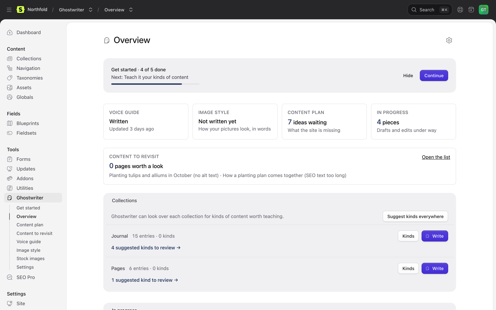
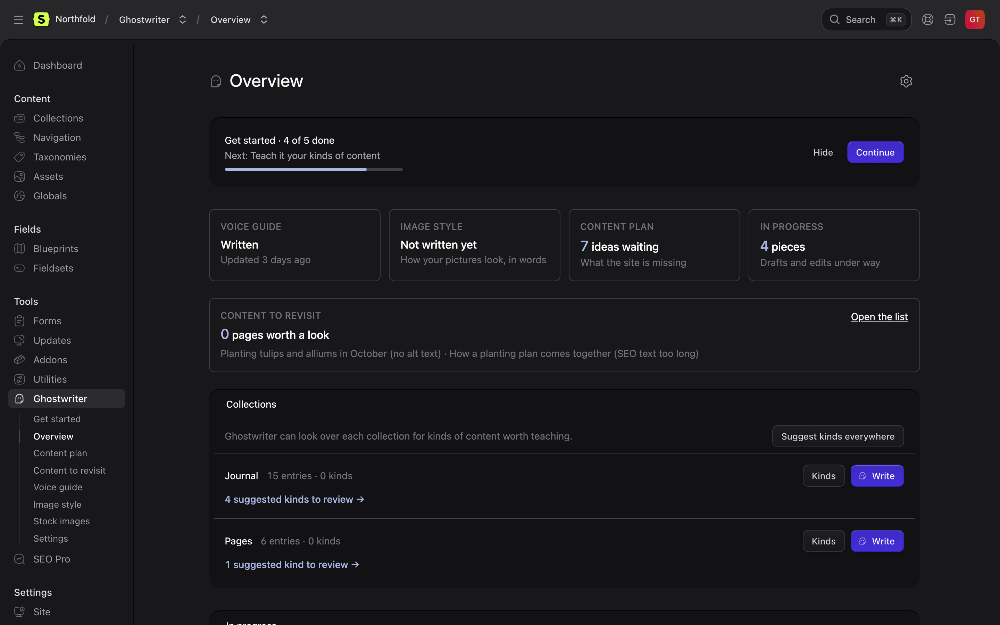
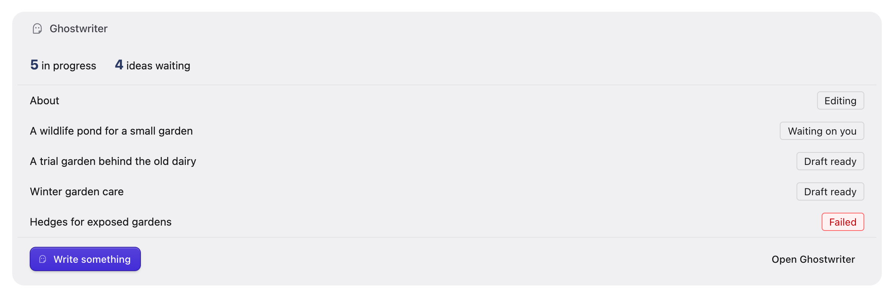

# The Overview and widget

This page covers Ghostwriter's own home page, the Overview, and the widget for Statamic's dashboard.

## The Overview

**Tools → Ghostwriter → Overview** (`/cp/ghostwriter`). It shows:

- **Get started**, while setup isn't finished: how many required steps are done, the next one, and **Continue**. Once they are all done, a one-line **You’re set up.** stays, with **Get started** for the optional steps, until Get started is hidden. Managers see **Hide** and **Hide Get started**. See [Finishing and hiding Get started](getting-started.md#finishing-and-hiding-get-started).
- **No API key yet**, as a warning, until the chosen provider has a key.
- **Four tiles**, each a link: **Voice guide** and **Image style** (**Written** or **Not written yet**), **Content plan** (ideas waiting) and **In progress** (pieces under way).
- **Content to revisit**: how many pages are worth a look, with the top few and their reasons, and **Open the list**. See [Content to revisit](suggest-edits.md#content-to-revisit).
- **Stock images**, only while there are stock previews still to license: how many, in amber when some are on live pages or their preview has expired, and **Open Stock images**. See [Stock photos](stock-photos.md).
- **Notes for super admins**, at the top, when there's something to fix outside Ghostwriter: a page template that prints no H1, a logo as the H1, or more than one (see [Headings](writing.md#headings)), and a collection with more pages than the list of link targets keeps (see [Links to your other pages](writing.md#links-to-your-other-pages)).
- **Collections:** every collection Ghostwriter writes for, with its entry count and its kinds, shown as small labels you can click to edit. Each has **Write**, to start a new entry, and a **Kinds** menu with **Teach a kind** and **Suggest kinds**. With more than one collection, **Suggest kinds everywhere** sits above them. **N suggested kinds to review** opens the suggestions. See [Kinds of content](kinds.md).
- **In progress:** pieces not yet saved as an entry, with their stage (**Writing**, **Waiting on you**, **Draft ready**, **In the form, not saved**, **Editing** and so on) and who started each ("Started by you", "Started by Maya Lindqvist"). Click one to carry on. **Remove** deletes it, for the person who started it and for managers (see [Deleting a piece](permissions.md#deleting-a-piece)). "A piece leaves this list once its entry has been saved." Finished pieces fold away under **Show N finished**.
- **Show Get started** at the foot, for managers, once Get started is hidden.

The cog in the header opens the settings, for managers only.



It follows the Control Panel's dark mode.



## The dashboard widget

Ghostwriter's widget goes on Statamic's own dashboard. Add it in `config/statamic/cp.php`:

```php
'widgets' => [
    ['type' => 'ghostwriter', 'limit' => 5],
],
```

A user's own `widgets` preference, if they have one, replaces that list for them; add the same entry there. In a user's YAML file:

```yaml
preferences:
  widgets:
    -
      type: ghostwriter
      limit: 5
```

It shows:

- Get started progress, until the required steps are done or it is hidden.
- How many pieces are **in progress** and how many **ideas waiting** on the plan.
- The latest pieces in progress, with their stage. With conversations shared, that is everyone's pieces.
- **Write something**, a menu of collections to start a new entry in, and **Open Ghostwriter**.
- With no API key, "Ghostwriter has no API key yet." as a warning. Its links still work, and **Write something** is disabled until a key is added.

`limit` is how many pieces it lists (5 by default, up to 20); `title` renames it. People without the Ghostwriter permission don't see it.



Next: [How Ghostwriter reads your fields](fields.md).
