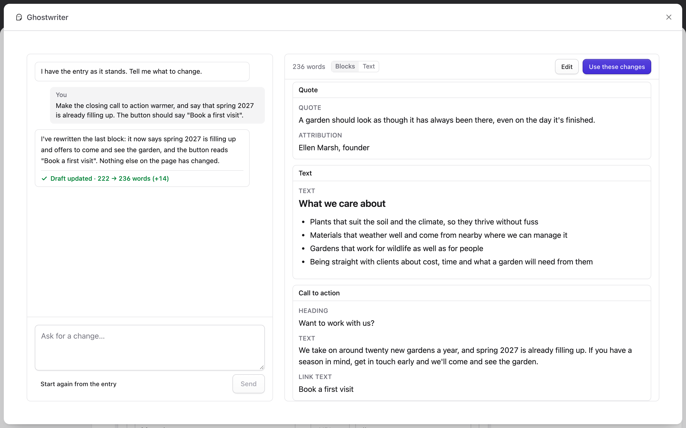

# Editing an existing entry

This page covers changing an entry that already exists, in conversation with Ghostwriter.

## Asking for changes

Open a saved entry in a collection Ghostwriter writes for, and click **Edit with Ghostwriter**, to the left of **Save & Publish**.

The panel opens with "I have the entry as it stands. Tell me what to change." The draft is the entry as the form holds it now, including anything you've typed and not yet saved. There is no brief: the entry is the brief.

Ask for what you want in plain words:

- "Tighten the introduction."
- "Rewrite this for a client who has never commissioned a garden."
- "Add a short section on maintenance before the closing paragraph."

The revised draft shows on the right, in **Preview** as the page will look with the changes (the entry is copied for the preview, with the draft over it; nothing is saved). You can change any writing in it yourself in **Blocks** or **Text**, as when [writing](writing.md#the-draft).

## Use these changes

**Use these changes** puts the revised writing into the form, and says "Changes added to the form. Check them over, then save."

- **The entry is untouched** until you save the form.
- **Blocks are matched by type, in order.** The entry's second text block takes the draft's second text block, even if the writer moved it. New blocks are added; blocks the writer removed are removed.

## Start again

**Start again from the entry** throws away the changes asked for in this conversation and starts again from the entry as the form holds it now. It asks first.

## Coming back

If you close the panel, or reload the page, before using the changes, they are kept: **Edit with Ghostwriter** picks up the same conversation.

Once changes have gone into the form, the next **Edit with Ghostwriter** starts again from what the form holds, so anything you've changed by hand since is included, saved or not.

## What is not changed

Only the writing changes. Images, links, chosen entries, settings, blocks that are switched off and block IDs stay as they are in the form, including changes you've made there and not yet saved. So do the sets in rich text (Bard) other than pull quotes: each stays after the words it followed, even when a chosen layout moves those words to another block.

Editing never applies [house style](fields.md#house-style) or [image placeholders](images.md#placeholders). Those are for new entries.

Next: [The voice guide and image style guide](guides.md).
