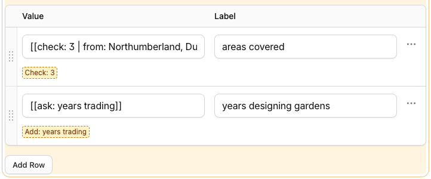
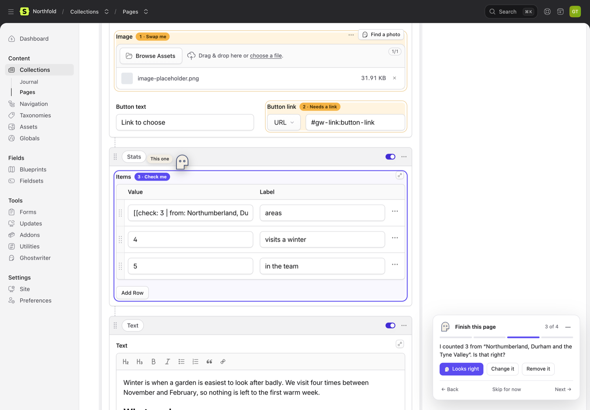
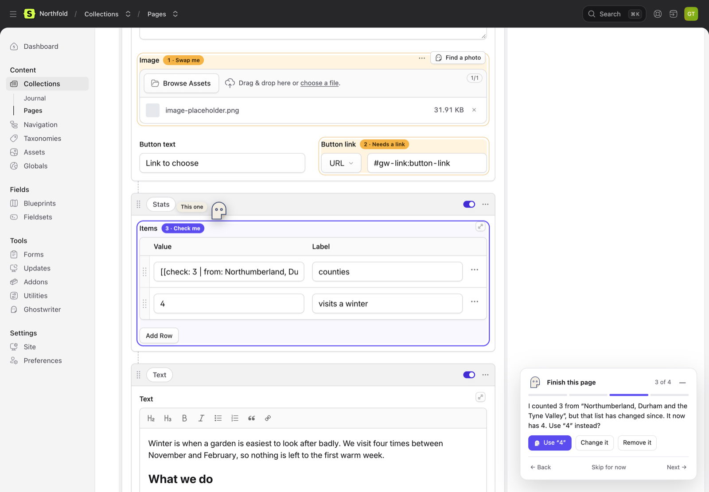
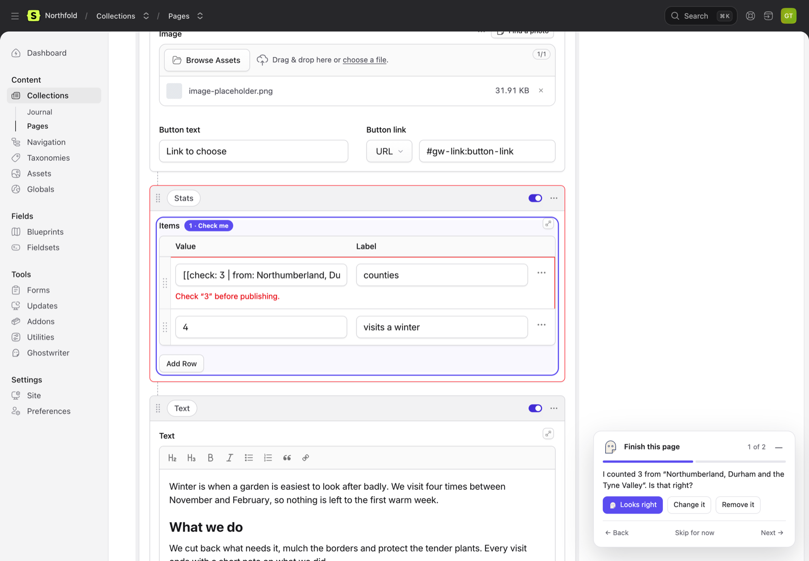

# Finish this page

Some things only a person can finish: the price of a ticket, where a button should go, the photo for the hero. Ghostwriter never makes these up. It marks the place instead, and **Finish this page** finds every mark in an entry, highlights it on the entry's form and walks you through it. A page can't be published while something still needs you.

It works on any entry in a collection Ghostwriter writes for, whoever wrote it.

## What it finds

| What | How it looks in the entry | Blocks publishing |
| --- | --- | --- |
| **A fact to add** | `[[ask: adult ticket price]]` in the text. Ghostwriter writes this wherever a draft needs a figure, a date, a name or a quote it wasn't given. | Yes |
| **A fact for a number or date field** | The field is empty, and the draft asked for it. | When the field is required |
| **A count to check** | `[[check: 3 areas \| from: Northumberland, Durham and the Tyne Valley]]`: a number Ghostwriter counted from a list you gave, in an [extra](writing.md#extras) such as a stat. See [Counts to check](#counts-to-check). | Yes |
| **A link to choose** | A link whose address is `#gw-link:contact-page`, in Bard or Markdown, or a Link field holding `#gw-link:…`. The words stay; only where it goes is missing. | Yes |
| **A link to a page that's gone** | A Link field, an Entries field or a Bard link pointing at an entry that has been deleted. | Yes |
| **An image placeholder** | Ghostwriter's striped placeholder (`ghostwriter/image-placeholder.png` in the field's container), in an assets field or inline in Bard. See [Images](images.md#placeholders). | Yes |
| **A stock preview not licensed** | A paid library's preview. See [Stock photos](stock-photos.md). | Yes |
| **Template text** | A placeholder such as `[[item]]` left in the text. | Yes |
| **An image the page looks like it needs, left empty**: it's required, it's the page's hero (the set the template prints the H1 from, or a hero image when there are too few published entries to go by), or at least 70% of the collection's 20 newest published entries have one. The step says which: "Hero image is required. Add one?", "Hero image is empty, but most Journal entries have one. Add one?" | | No: it's counted and brings the guide out, but only Statamic enforces required. Not on a new entry until a draft is put in or it has some text. |
| **A link field left empty** that most entries like this fill | | No: it's counted, not enforced |
| **A field most entries fill, left empty**, and text such as `TBC`, `[insert date]` or `lorem ipsum` | | No: a suggestion only |

A required text, date or select field left empty isn't listed: Statamic's own validation says so when you save.

Everything is found from the entry's values and its blueprint, as you type. Finding them never asks a model and never saves anything.

### The markers

- `[[ask: …]]` is plain text, so it survives every field: Bard, Markdown, text and textarea. It shows on the page in Live Preview, on purpose. Type the fact over it, or use the guide.
- `#gw-link:` is a real link to a place on the same page, so if one were ever published it would go nowhere rather than to a wrong page. Choose an entry for it, or remove the link and keep the words.
- `[[check: … | from: …]]` holds a count and the list it was counted from. It shows on the form as written, and in the panel's preview as the number alone.
- No keyword is translated. The words inside are in your site's language.

## On the entry's form

When an entry has something to finish, a count appears on the menu beside **Edit with Ghostwriter** (amber: it stops the page going live), and the fields are highlighted. The menu's **Finish this page**, with the same count, opens the guide:

- **amber**: still to do (or skipped for now);
- **purple**: the one the guide is on;
- **green**: fixed since you opened the page.

Each highlighted field has a numbered tag ("2 · Needs a link"); click it to go to that step. Inside Bard, the marker itself is underlined with a dashed line, so you can see exactly where the gap is.

A plain text box (a text field, or a cell of a Grid or Table) can't underline part of its text, so one holding a gap gets a row of small chips under it, one per gap: "Add: years trading", "Check: 3", "Choose a link: contact page". The field keeps its highlight and tag. The chips follow your typing, and they're never part of the value.

### The guide

Click the count, or the Ghostwriter button in the bottom corner, to open the guide. It shows one gap at a time: what's missing, and what you can do about it. It opens the field's tab, expands a collapsed set and scrolls to it, and the Ghostwriter mark flies over to point at it.

- **A fact to add:** type it into the box in the guide and press Enter. It replaces the marker in the field. Esc clears the box.
- **A link to choose:** first, the page Ghostwriter suggested for a link the writer left (**Link to Contact us**: picked when the draft was linked to your pages and checked by a second look, never put in for you); then **Link to Contact** when an entry's title or slug matches the link's hint, without repeating the suggested page; otherwise **Choose an entry** (the field's own picker, or type an address) or **Remove the link**, which keeps the words.
- **An image placeholder or an empty image:** **Find a photo** (Ghostwriter's image dialog for that field), **Choose from Assets**, or **Leave it empty** when the field isn't required.
- **A stock preview:** **License**, which opens the same License & replace step as the field's badge (or Request licence, without the permission), or **Choose another**.
- **A count to check:** see below.
- **Template text:** **Remove it**.

### Counts to check

A stat such as "3 areas" may be counted from a list you gave ("Northumberland, Durham and the Tyne Valley"). Ghostwriter counts the list itself; the model never supplies the number. Before the page goes live, the guide asks you to check it:

> I counted 3 areas from "Northumberland, Durham and the Tyne Valley". Is that right?

- **Looks right** puts the count in place of the marker.
- **Change it** opens the count to edit, filled in: change it and press Enter (Esc goes back).
- **Remove it** takes it out.

If the list has changed since (in your answers, your messages or the draft), the step says so and offers the new count first:

> I counted 3 areas from "…", but that list has changed since. It now has 4. Use "4 areas" instead?

When no list like it is there any more, it asks whether the count is still right, with **Change it** and **Remove it**; when the number was edited by hand and no longer matches its list, it offers the list's own count. Each is counted on the menu, tagged "Check me" on its field, underlined in Bard like a fact to add, and [blocks publishing](#publishing) until it's resolved.

**Back**, **Skip for now** and **Next** move between gaps. A skipped gap stays highlighted and still counts. Every fix goes into the form only: nothing is saved until you press Save.

Press **—** (or Esc while you're in the guide) to tuck it away into the corner button, which shows the count; click it to bring the guide back. Ghostwriter remembers, for each person, whether they left the guide open. It starts tucked away, and opens by itself when you put a Ghostwriter draft into the form (`finish.open_after_draft`).

The count and the highlights follow your typing: the form is checked again a moment after you stop.

### Keyboard and screen readers

- **Alt+Shift+N** and **Alt+Shift+P**: the next and previous gap. **Alt+Shift+G**: open or tuck away the guide. They work anywhere except while typing in a field.
- The guide is a labelled region that never traps focus, so the form stays usable. Each step, each fix and opening or closing it are announced. Highlighted fields carry a hidden "Ghostwriter: needs a link" note, and every tag is a button.
- With **Reduce motion** on in your system, nothing moves: no flight, no bobbing, no animations when it opens or closes.

On a phone the guide is a sheet along the bottom of the screen that folds down to one line ("2 of 5 · Needs a link · Next"), and the button beside Save shows just the ghost and the count. It follows Statamic's dark mode.

## Publishing

When an entry is saved as published (now, or on a future date), publishing a working copy included, and something in the table above blocks, the save is refused with a message on each field:

> Add adult ticket price before publishing.

> Choose where this link goes before publishing.

> Check "3 areas" before publishing.

Saving it unpublished always works, and drafts Ghostwriter writes start unpublished (see [Use this draft](writing.md#use-this-draft)). Markers are never removed silently: a sentence with its fact cut out reads worse than one that plainly needs it.

Set **When a page with something unfinished is published** (Ghostwriter → Settings → Finish this page) to **Warn**, or `GHOSTWRITER_ON_UNFINISHED_PUBLISH=warn`, to publish with one warning naming everything instead. Visible `[[ask: …]]` text then goes live, so Block is the default.

This is the same rule as for [stock photos](stock-photos.md#publishing): one check, one message.

## Fixes that write

Two fixes ask Ghostwriter to write, and say so on the button. Each is one small request, only when you press it, and the result goes into the form for you to check and save:

- **Write around it**, on a fact to add: the sentence rewritten without the fact, adding nothing new. Use it when the page reads well enough without the detail.
- **Write it for me**, on an empty summary or other short text field: a line drawn from the page's own words.

Ghostwriter never fills in a fact. There is no "suggest a price" button, and an answer holding a figure the page doesn't have is thrown away.

## Settings

| Setting | Default | |
| --- | --- | --- |
| `publish.on_unfinished` (`GHOSTWRITER_ON_UNFINISHED_PUBLISH`) | `null` (the settings screen; **block** if that is blank) | `block` or `warn`. Replaces `stock.on_publish`, which is still read when this isn't set. |
| `finish.open_after_draft` (`GHOSTWRITER_FINISH_OPEN_AFTER_DRAFT`) | `true` | The guide opens by itself when a draft is put into the form. |
