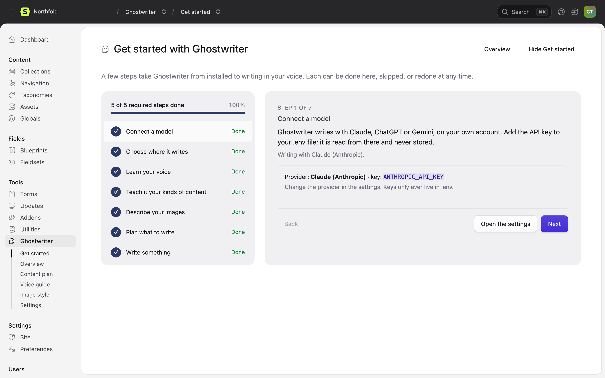
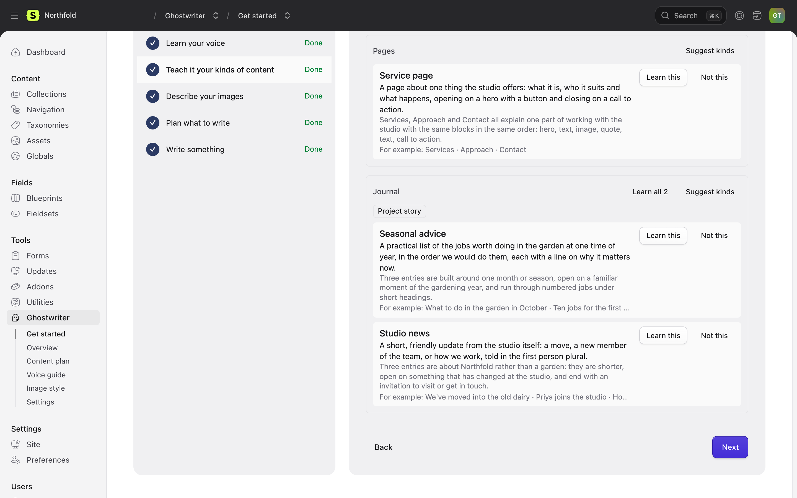

# Get started

**Ghostwriter → Get started** is a wizard of seven steps that takes Ghostwriter from installed to writing in your voice. It stays in the navigation until it is hidden.

The list on the left shows each step as **Done**, **To do**, **Optional** or **Working…**, under a bar such as "5 of 5 required steps done". Only the five required steps count; the two optional ones don't hold the bar back. The page opens on the first required step still to do. Click any step to go straight to it: the address changes to `#step-3` and so on, so a step can be linked to. **Next**, **Skip** and **Back** move between steps, and every step can be redone later.

A model call (writing a guide, looking over a collection) runs in the background. You can leave the page while it works.

## 1. Connect a model

Shows which provider Ghostwriter writes with, such as "Writing with Claude (Anthropic).", and the key it reads. If the key isn't set, add it to `.env` and reload the page. If another provider's key is set instead, it says so. See [API keys](api-keys.md).

## 2. Choose where it writes

The collections Ghostwriter writes for, and the ones it reads to learn your voice. Only the collections it writes for get the **Write with Ghostwriter** button.

If you may change Ghostwriter's settings, choose them right here: tick **Write for it** and **Learn the voice from it** for each collection, then **Save these collections**. Ticking every collection means all of them, including any added later. A list set in `config/ghostwriter.php` can't be changed here, and the step says so. Everyone else sees which collections are chosen.

## 3. Learn your voice

**Write the voice guide.** Ghostwriter reads the newest published entries in the chosen collections and writes a [voice guide](guides.md#the-voice-guide). Read it, and correct anything that isn't right. Everything Ghostwriter writes follows it.

Without a voice guide, Ghostwriter still writes, but in a plain voice rather than yours.

## 4. Teach it your kinds of content

When Get started opens, Ghostwriter looks over each collection it hasn't looked at yet, or that has had ten or more entries published since, and suggests the kinds of content in it, such as "Case study" or "Service page". A collection needs at least two published entries to look over.

This is the only place kinds are suggested by themselves. Everywhere else, they wait for someone to click **Suggest kinds** or **Suggest kinds everywhere**, so no model call happens without someone asking. Turn the automatic look off with **Suggest kinds of content** in the [settings](configuration.md#settings).

Each suggestion shows what the kind is, why it's worth teaching, and a few of the entries it was found in. **Learn this** on the ones you write often; each gets its own brief. **Not this** dismisses one. **Learn all N** asks first, then learns every suggestion in a collection, one after another. See [Kinds of content](kinds.md).

Every collection can be written for without this step; it then uses a general brief.

## 5. Describe your images (optional)

**Describe the images.** Ghostwriter looks at the pictures your entries use and writes an [image style guide](guides.md#the-image-style-guide), so the photos it finds and the images it makes belong beside them. A collection needs at least three images to describe.

## 6. Plan what to write (optional)

**Suggest ideas.** Ghostwriter reads the site and suggests entries it is missing. Keep the good ones on the [content plan](content-plan.md).

## 7. Write something

Pick a collection and start a new entry with Ghostwriter beside it. See [Writing a new entry](writing.md). **Finish** takes you to the Overview.

## Finishing and hiding Get started

Once the required steps are done, the [Overview](dashboard.md) shows a one-line **You’re set up.** until Get started is hidden. Hiding it hides it for everyone, so only someone who may change Ghostwriter's settings can do it:

- **Hide Get started** on the Get started page or the Overview (or **Hide** on the Overview's progress card) removes it from the navigation and the Overview.
- **Show Get started** at the foot of the Overview brings it back. So does turning on **Show Get started** in the settings and saving; that setting acts once and isn't stored.

Next: [API keys](api-keys.md).
