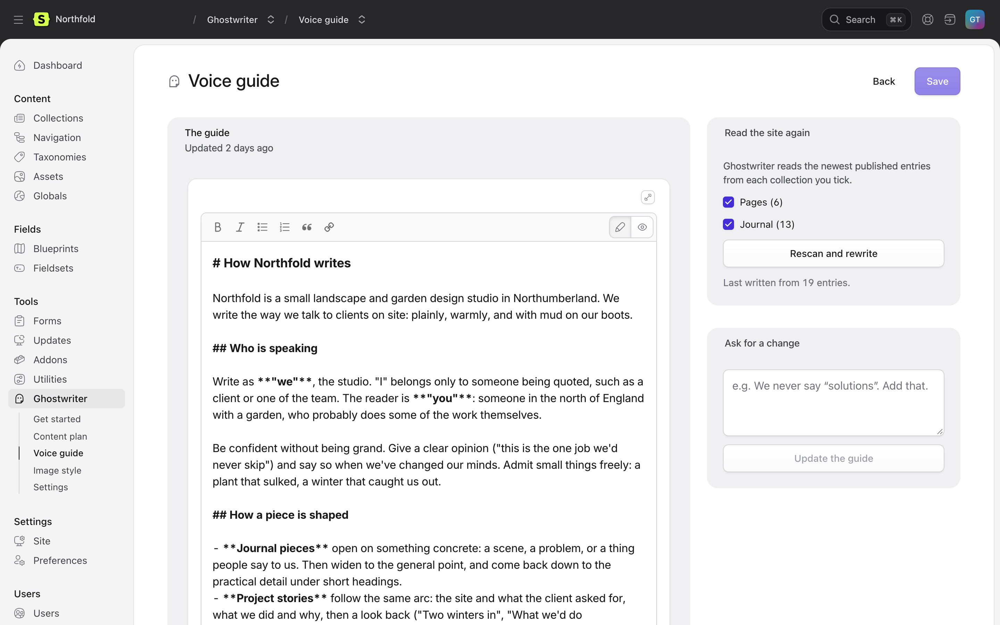
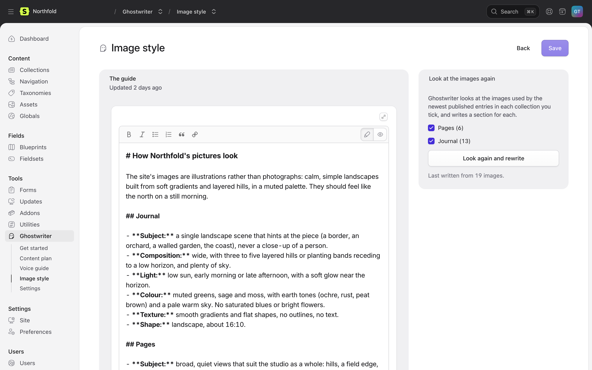

# The voice guide and image style guide

This page covers the two guides Ghostwriter writes from your site: how it sounds, and what its pictures look like. Both are markdown files in your project. Ghostwriter writes the first version, and you correct it. Both are read every time Ghostwriter writes, or finds or makes an image.

## The voice guide

**Ghostwriter → Voice guide.** It describes how your site sounds, with real examples from your entries: who is talking and to whom, the attitude, how pieces are shaped (openings, headings, endings, length), and the words you use and the ones you never do.

### Writing it

Tick the collections to read, then **Write the voice guide** the first time, or **Rescan and rewrite** under **Read the site again** after that. Ghostwriter reads the newest published entries in those collections, spread across them, and writes the guide in a minute or so. Rescanning replaces the guide, and asks first.

How much it reads is set by `voice.max_entries` and the other `voice.*` keys in [Configuration](configuration.md).

### Changing it

- Edit it in the editor, then **Save**.
- Or **Ask for a change** in plain words, such as "We never say solutions. Add that.", then **Update the guide**. Ghostwriter rewrites the guide with the change, and says what it did.

While there are unsaved edits, rescanning and asking for a change wait: "Save your edits first."

The guide is kept in `resources/ghostwriter/voice.md` (see [Where things are kept](configuration.md#where-things-are-kept)). Commit it, so every environment writes the same way.

## The image style guide

**Ghostwriter → Image style.** It describes what your pictures look like, collection by collection: photography or illustration, subjects, composition, light, colour, mood, what would look wrong, and how to search for one that fits.

### Writing it

Tick the collections to look at, then **Describe the images** the first time, or **Look again and rewrite** under **Look at the images again** after that. Ghostwriter looks at a few images from each image field used by the newest published entries, including those inside page-builder blocks, and writes one `##` section per collection. A collection needs at least three images. The number looked at per collection is `images.guide_samples` (10 by default).

### Changing it

Edit it in the same way as the voice guide. Keep a `## Collection title` heading for each collection: that is how Ghostwriter finds the part that applies to an image. As with the voice guide, looking again waits while there are unsaved edits.

The guide is kept in `resources/ghostwriter/imagery.md`.

### Where it is used

- Choosing what to **search for** when finding a photo.
- **Ranking** the photos found against your site.
- **Making** an image.

See [Images](images.md).

## When something goes wrong

If writing or changing a guide fails, the reason stays at the top of the screen, under **That didn't work**, until the next run, even if you were away when it failed.

Next: [Kinds of content](kinds.md).
