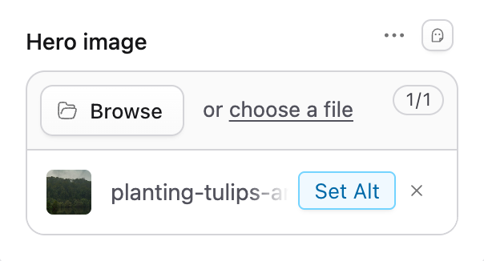
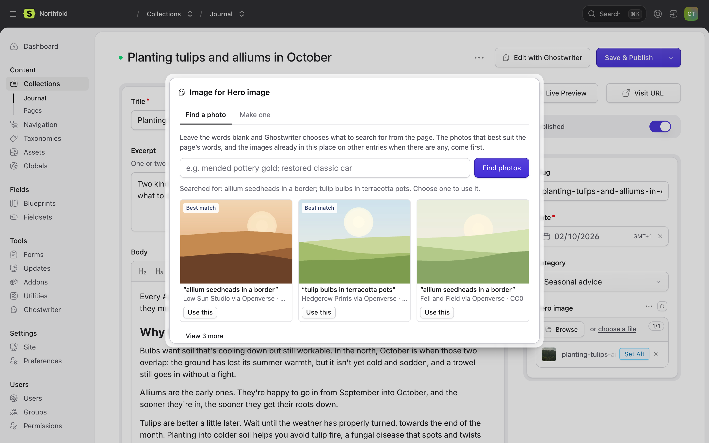
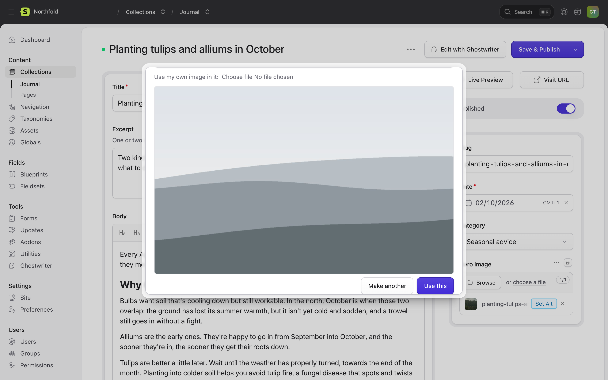
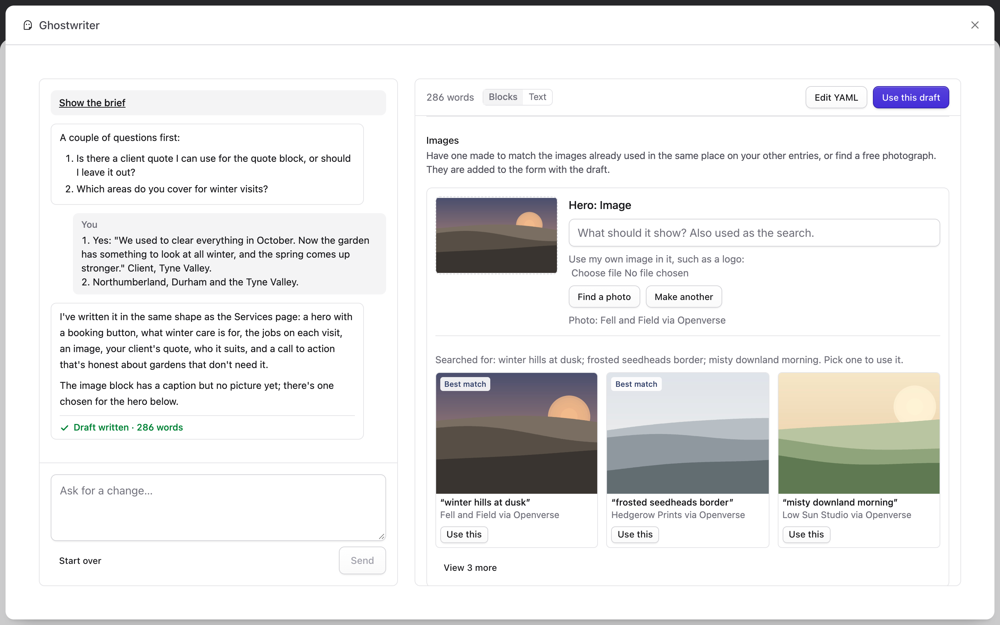

# Images

This page covers finding and making images: the image button on assets fields, the Images section under a draft, how photos are ranked and named, and placeholders.

## The image button

Every assets field on an entry's create or edit screen, in a collection Ghostwriter writes for, has a small **Ghostwriter** button (the ghost) beside the field's own controls, for people with the Ghostwriter permission. The field needs a container. On a field that takes only other kinds of file (validated as `mimes:pdf`, say), Ghostwriter says it can't help.

Click it to open **Image for** and the field's name, with two tabs: **Find a photo** and **Make one**. Where only one is available, only that tab shows; with neither, the dialog says which keys to add.

Ghostwriter picks images to suit the words of the block the field is in and the rest of the page, as the form holds it now, saved or not. Where other entries already have images in the same place (the same field, in the same kind of set), it matches those too, in style and shape. The [image style guide](guides.md#the-image-style-guide) adds the words for that style.

## Find a photo

Searches free photo libraries: Openverse (no key needed), and Unsplash, Pexels and Pixabay when you've added their keys. See [API keys](api-keys.md#free-photo-libraries).

1. Type what the picture should show, or leave it empty and Ghostwriter chooses three searches from the page. Separate your own searches with semicolons.
2. **Find photos.** "Searched for: …" shows the searches that ran, which explains any odd result.
3. The best three come first, with **Best match** on the ones the model picked. **View N more** shows the rest of those that fit.
4. Click a photo, or its **Use this** button. The credit under each one links to it on the library's site.

**How photos are ranked.** The model looks at each result beside the words around the field and what the library says the photo shows, and leaves out clear misses. This happens whether or not other entries have images in that place; with none, a line says "Compared with the page; there are no other images here to match." If nothing fits, the model names better searches and a second round runs. If that finds nothing either, the top results come back with a line saying none fitted.

Without a writing model to judge them, the top result of each search comes first, with no **Best match** badge, and a line says they weren't compared with the page.

### Names, alt text and credits

- The file is named and titled from what the library says the photo shows, for example `brown-rocks-at-golden-hour-x7k2qa.jpg` and "Brown rocks at golden hour", falling back to the search words.
- The library's description goes in the asset's **alt** text, where the container's blueprint has an `alt` field (Statamic's default asset blueprint does).
- The photographer, library and licence are saved on the asset as `credit`, `credit_url` and `licence`, for example "Jane Doe on Unsplash". Add fields with those handles to the container's blueprint to see and print them.

Openverse photos are public domain or CC0. Unsplash, Pexels and Pixabay photos are under their own free licences, which ask you to credit the photographer where you can.

## Make one

Needs an OpenAI or Gemini key; without one, the tab isn't shown. See [API keys](api-keys.md).

1. Optionally, say what it should show. Leave it blank and Ghostwriter decides from the page.
2. Optionally, **Use my own image in it**, such as a product shot. It is placed in the picture as it is, not redrawn.
3. **Make the picture.** It takes a minute or two, in the style of the images already in that place.
4. **Use this**, or **Make another**.

A logo or brand mark is never made or found. For a logo, add the file to the field yourself, or give it as your own image in step 2.

## What happens when you choose one

- The image is saved as an asset in the field's own container and folder, or beside the images already there.
- It goes straight into the field, and Ghostwriter says "Image added. Save to keep it." Save the entry as usual.
- A striped placeholder in the field comes out. In a field that holds one image, the new one replaces the old.
- A field that holds several images and is already full doesn't take another. The image is still saved in the container, and Ghostwriter says so: remove one from the field to make room, then choose it from the container.

## Images with a draft

Under a draft in the writing panel, the **Images** section lists each image field the entry normally has: the top-level ones, and those in the draft's blocks that other entries fill in.

- Photos are offered for each field as soon as the draft is written, from the writer's own searches, ranked the same way as on the image button, against the words of the draft. "Searched for: …" sits above them; **View N more** shows the rest.
- **Find a photo** runs your own search. **Choose from the photos for** another field, or **Use the same image as** another field, where fields share a picture.
- **Make the picture** (or **Make another**) makes one, with the same keys as on the image button, and can **Use my own image in it, such as a logo**.
- Asking in the conversation works too: "find images for this" offers options, "add the images" puts the best match straight in.

Chosen images go into the form with **Use this draft**. On a new entry, an image you already chose in the form yourself is kept. Images chosen or made while Ghostwriter is working on a message are kept when it finishes.

## Placeholders

When a draft is put into a **new** entry, image fields it leaves empty get a striped placeholder, but only where the collection's entries usually have an image there, or the field is required. Optional images most entries leave empty, and fields that take no pictures, are left alone.

- The placeholder is one shared asset, `ghostwriter/image-placeholder.png`, in the field's container.
- The notes above the form list every field that has one.
- Replace them with the image button before publishing.

Turn this off with **Mark images still to choose** in the settings, or `images.placeholders` in the config.

## Requests are private

A photo search or a picture being made belongs to the person who started it, even when conversations are shared. Requests, and made pictures waiting to be used, are cleared after a day.

Next: [The content plan](content-plan.md).
