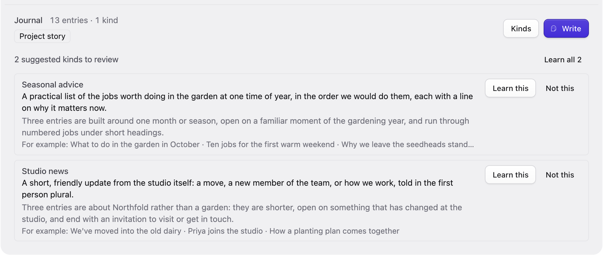
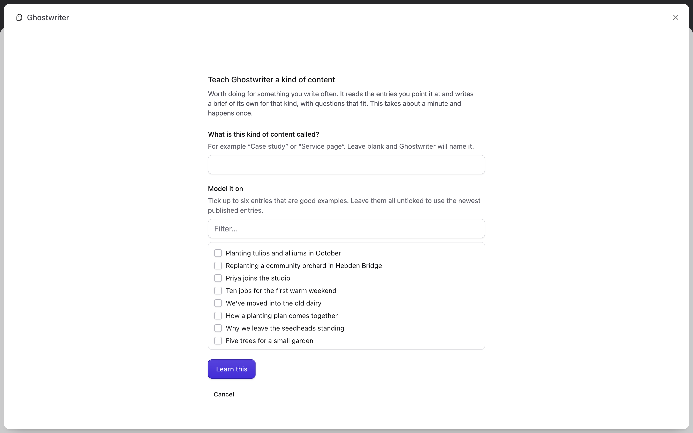
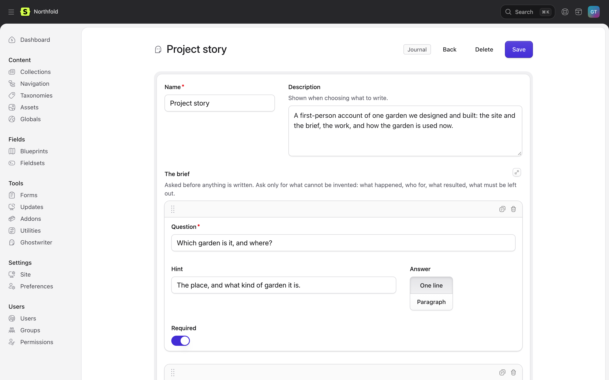

# Kinds of content

This page covers kinds of content: what they are, how Ghostwriter suggests them, teaching and editing them, and where they are kept.

Every collection can be written for straight away, with a general brief. A **kind** is something you write often in a collection, such as a project story, a guide or a service page, with a brief of its own:

- **questions** asked before anything is written, about the facts that can't be invented;
- **guidance** for the writer: who the reader is, what each part does and in what order, how long it runs;
- **a checklist** of things that must be true of a finished draft;
- **examples**: entries the kind is modelled on, for structure, length and how blocks are used.

## Suggested kinds

Ghostwriter looks at a collection's entries (their titles, how they are built, how they open) and suggests the kinds of content in it.

- It looks **by itself** only on [Get started](getting-started.md#4-teach-it-your-kinds-of-content): the first time a collection is seen there, and again once ten or more entries have been published since. A collection needs at least two published entries. Each look is one model call. Turn it off with **Suggest kinds of content** in the settings.
- Everywhere else, kinds are suggested only when someone asks: **Suggest kinds** in a collection's **Kinds** menu on the [Overview](dashboard.md), or **Suggest kinds everywhere** above the collections, shown when there is more than one.

Suggestions appear under the collection as **N suggested kinds to review**. Each card shows the kind's name and description, why it is worth teaching, and **For example:** up to three of the entries it was found in. Then:

- **Learn this** writes the brief for that kind from the entries it was suggested from. It takes about a minute. The Overview says "Learning. The new kind appears here in a minute or so." and the collection's row shows the progress. If it fails, the reason stays under the collection until the next try.
- **Not this** dismisses it. Dismissed kinds aren't suggested again.
- **Learn all N** asks first ("This takes about a minute each."), then learns every suggestion in the collection, one after another.



## Teaching a kind yourself

**Teach a kind**, in a collection's **Kinds** menu on the Overview or on **What are you writing?** in the panel, teaches one by hand:

1. **What is this kind of content called?** For example "Case study". Leave it blank and Ghostwriter names it.
2. **Model it on:** tick up to six entries that are good examples, or leave them unticked to use the newest published entries.

**Learn this** starts it. Ghostwriter reads the entries, about a minute, and writes the questions, guidance and checklist from them. The new kind appears on the Overview when it is done. Two kinds with the same name get their own handles (`event`, `event-2`); nothing is overwritten.



## Editing a kind

Click a kind on the Overview to open it. You can change:

- **Name** and **Description** (shown when choosing what to write).
- **The brief:** the questions. Each has a **Question**, a **Hint**, an **Answer** length (**One line** or **Paragraph**) and whether it is **Required**. Ask only for what can't be invented: what happened, who for, what resulted, what must be left out. A kind needs at least one question.
- **Guidance for the writer**, in markdown. The fields themselves are read from the blueprint, so the guidance doesn't need to list them.
- **Check before handing over:** short statements that must be true of a finished draft.
- **Modelled on:** the example entries.

**Save** keeps the changes. **Delete** asks first, then removes the kind and says **Kind deleted**; entries already written with it aren't affected.



**Something like what is already here**, on **What are you writing?**, is different: those are groups Ghostwriter finds by how entries are built, without teaching, and they aren't edited here.

## When a blueprint changes

A kind doesn't store the fields. Ghostwriter reads the blueprint every time it writes, so a field added or removed is picked up straight away. If the change makes a kind's guidance wrong (a block it mentions is gone, say), edit the guidance, or delete the kind and teach it again.

## Where kinds are kept

Each kind is a YAML file in `resources/ghostwriter/types/`, so it can be versioned with your project and edited by hand:

```yaml
title: Case study
description: Tells one project from start to finish.
collection: case_studies
blueprint: case_study          # optional, for collections with several
examples: [entry-id, ...]      # optional: model the kind on these entries
where: { categories: guides }  # optional: learn only from entries matching this
defaults: { categories: [guides] }   # optional: entry data set on everything written
questions:
  - handle: client
    label: Who is the client?
    type: text                 # text (One line) or textarea (Paragraph)
    required: true
guidance: |
  Markdown: who the reader is, what each part does and in what order, how long it runs.
checklist:
  - The result states only outcomes given in the brief.
```

A question's handle is made from its wording, and kept when you reword it; to set one yourself, edit the file.

Next: [Images](images.md).
