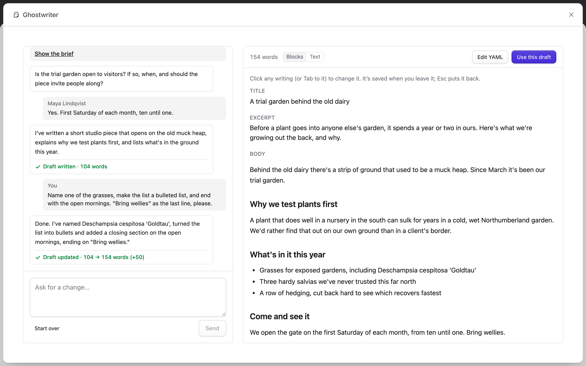

# Permissions

This page covers who can use Ghostwriter, who can manage it, and how conversations are shared.

> **Statamic Pro only.** Roles, permissions and more than one Control Panel user are features of Statamic Pro. On Statamic Core (Solo) there is a single super user, who can do everything on this page, so the Ghostwriter permission, manager rights and shared conversations make no difference there.

## Using Ghostwriter

Ghostwriter adds one permission, in a role under **Permissions**: **Write content and edit the voice guide with Ghostwriter** (`access ghostwriter`).

People with it see Ghostwriter in the navigation (under Tools), the **Write with Ghostwriter** and **Edit with Ghostwriter** buttons, the image button on assets fields, and the dashboard widget.

Ghostwriter never lets anyone do what they couldn't do by hand:

- Putting a draft into a new entry needs Statamic's own permission to create entries in that collection, and editing an entry needs the permission to edit it.
- Saving an image into an assets field needs the permission to upload to that field's container.

## Licensing stock photos

**License stock images from paid libraries** (`license stock images`) lets someone license a paid stock photo, which spends from your account with the library. Nobody has it by default; super users do. Without it, an editor can still insert a preview and press **Request licence**. See [Stock photos](stock-photos.md#permissions).

## Managing Ghostwriter

Managers are super users, and people with Statamic's permission to edit the addon's settings (**Ghostwriter settings** under the addon permissions, `edit 1994/ghostwriter-statamic settings`). Only they can:

- open Ghostwriter's settings (the cog on the Overview, and **Settings** in the navigation);
- choose collections on Get started's second step;
- hide Get started, or show it again;
- delete a piece someone else started, when conversations are shared.

## Shared conversations

This needs Statamic Pro, which allows more than one user.

Every conversation is shared with everyone who has the Ghostwriter permission. Anyone can open a piece from the content plan, the [Overview](dashboard.md), the widget, the panel's **Or carry on with**, or the entry itself, and carry it on.

- Each message shows who sent it: **You**, or the person's name.
- Pieces show who started them and who changed them last, such as "Started by Maya Lindqvist · last changed by you", in **Or carry on with**, on the Overview and on the content plan.
- Ghostwriter answers one request at a time on a piece. While someone else's request runs, the panel says "Maya is waiting on Ghostwriter", and sending waits until it has answered.



To keep conversations private instead, set `shared_conversations` to `false` in `config/ghostwriter.php`, or in `.env`:

```dotenv
GHOSTWRITER_SHARED_CONVERSATIONS=false
```

Then a conversation belongs to whoever started it: nobody else sees it on the Overview, the widget or the plan, or can open it, super users aside.

## Deleting a piece

With conversations shared, **Remove** is shown only to the person who started a piece and to managers. Everyone else can carry it on, but not delete it. With conversations private, you can remove your own pieces.

Removing a piece deletes its conversation and draft. An entry already saved from it isn't touched.

Next: [Configuration](configuration.md).
