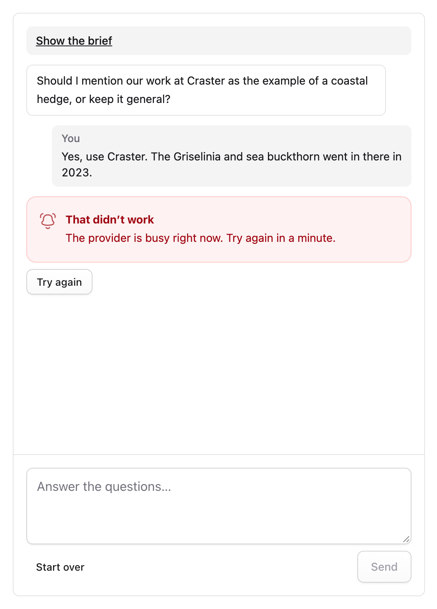

# Troubleshooting

This page covers common problems and what to do about them.

## No API key yet

Ghostwriter says "No API key yet" (or "Ghostwriter has no API key yet." on the widget) when the chosen provider's key isn't set. Add it to `.env` (see [API keys](api-keys.md)) and reload the page; run `php artisan config:clear` if your config is cached. On a server, set the variable where your host keeps environment variables, then redeploy. If the key is set but calls fail with "not scoped to a workspace", make the key again from the Anthropic account's default workspace.

## Nothing happens after asking for something

Model calls run in the background.

- **Using a queue connection?** Make sure a worker is running (see [The queue](installation.md#the-queue)). If nothing picks the work up for a while, the panel, the guide screens and the image dialog say "Still waiting for a queue worker to pick this up. Is “php artisan queue:work” running?"
- **On the `sync` driver?** The call runs after the response is sent, which needs PHP-FPM. `php artisan serve` blocks; use Herd, Valet or your server.
- **Look at the log** (see [Seeing what went wrong](#seeing-what-went-wrong)).

## A model call times out

Long drafts can take several minutes on the larger models. Raise `timeout` in [`config/ghostwriter.php`](configuration.md#the-time-limit) (or `GHOSTWRITER_TIMEOUT`), for example to `600`, and raise your worker's limit to match: `timeout × 3 + 60`. A timeout isn't retried by itself.

## "That didn't work"

When a turn fails, the panel says **That didn’t work** with the reason. **Try again** sends the same message again; there is no need to type it out.



## Busy, overloaded or rate limited

Ghostwriter tries a busy or rate-limited provider again by itself, up to three attempts, waiting as long as the provider asks. If it is still busy after that, the turn fails with a message naming the provider, such as "… is busy right now. Try again shortly." or "… is limiting requests. Try again in a minute." Wait, then **Try again**. See [Busy providers and retries](api-keys.md#busy-providers-and-retries).

## "The draft was longer than Ghostwriter allows and was cut off"

A reply that runs out of room is asked for once more with twice the room. If it still doesn't fit, the turn fails rather than keep a half-written draft. Ask for a shorter piece, or for one part at a time. The voice guide can fail the same way; read fewer collections, or ask for a shorter guide.

If a worker stops a job partway (its own time limit, say), the work shows "This stopped before it finished" once its job can no longer be running (`timeout × 3 + 60` seconds, plus two minutes). Check the worker's `--timeout` is at least `timeout × 3 + 60`, then try again.

## The draft is put in, but something is missing

Read the notice above the form after **Use this draft**. It lists:

- image fields with a striped placeholder;
- choices, related entries and links still for you to set, and links pointing to `https://example.com` for now;
- fields and blocks the draft used that this blueprint doesn't have, and options that don't exist (left out);
- blocks that are the same on every entry, where the usual content was used in place of what was drafted.

## "The page template couldn't render this draft"

The Preview tab rendered the draft through the entry's template and the template failed. The message gives the error's first line; super users also see the exception, the template and where it was thrown, and the error is in `storage/logs/laravel.log` as usual. Usually the template expects something the draft doesn't have yet (an image, a related entry). The draft is fine: use **Show blocks instead**, or **Use this draft** and save. To keep a template from tripping on a draft, test `{{ live_preview:ghostwriter }}` (see [The preview, for site developers](writing.md#the-preview-for-site-developers)).

## No Find a photo button on an assets field

The button only appears:

- on entry create and edit screens in collections Ghostwriter writes for;
- for people with the Ghostwriter permission;
- on fields with a container.

## No "Make one" tab

Making images needs an OpenAI or Gemini key. Gemini needs billing turned on for its image model, and OpenAI may ask you to verify your organisation first.

## Photo search finds little

- Add an Unsplash, Pexels or Pixabay key: Openverse on its own has a smaller, more archival collection.
- Type simple, concrete searches: "stone wall garden", not "sustainable landscaping".
- Unsplash's demo mode allows 50 requests an hour.

## "Maya is waiting on Ghostwriter"

Someone else's request on this piece is running, and Ghostwriter answers one at a time. Sending waits until it has answered. See [Shared conversations](permissions.md#shared-conversations).

## Gemini: "quota exceeded" or "model not found" on the free tier

The free tier covers Flash models only, with daily limits. Leave **Model** blank to use the default Flash model, set a 3.x Flash model, or turn on billing. See [API keys](api-keys.md#google-gemini-and-images).

## Seeing what went wrong

Ghostwriter logs errors to Laravel's log, `storage/logs/laravel.log`, prefixed "Ghostwriter:". Each model call is logged too, with its provider, model, tokens and time. Set `log_channel` to send these lines elsewhere. Failed queued jobs are listed by `php artisan queue:failed`.

When a model's reply can't be read (no `<type>` block, say, or YAML that doesn't parse), the log says what was wrong with it, such as "the type analysis for articles could not be read (the YAML did not parse at line 3)", but not the reply itself, which can quote your site's content and what was written in a conversation. To see the whole reply while tracking a problem down, set `GHOSTWRITER_LOG_REPLIES=true` in `.env` (`debug.log_replies` in `config/ghostwriter.php`): it is then added to the log entry under `reply`. Turn it off again afterwards. Prompts and keys are never logged.

## The Control Panel screens look broken

Usually after an update. Publish the assets again:

```bash
php artisan vendor:publish --tag=ghostwriter-statamic --force
```
