# Writing a new entry

This page covers writing a new entry with Ghostwriter: choosing what to write, the brief, the conversation, the draft, and putting it into the form.

## Starting

Open a collection's **Create Entry** screen and click **Write with Ghostwriter**, to the left of **Save & Publish**. The button appears on new entries in the collections Ghostwriter writes for, for people with the Ghostwriter permission. On an existing entry the button is **Edit with Ghostwriter**; see [Editing an existing entry](editing.md).

You can also start from:

- **Write** beside a collection on the [Overview](dashboard.md);
- **Write something** on the [dashboard widget](dashboard.md#the-dashboard-widget);
- **Write with Ghostwriter** in a collection's actions menu, on its entry list;
- **Draft this** on an idea in the [content plan](content-plan.md).

Each opens a new entry with Ghostwriter already open. Ghostwriter opens in a full-width slide-over; the entry form stays underneath.

## What are you writing?

Choose what this entry is:

- **From the content plan:** ideas waiting to be written. Choosing one fills in the brief card from the idea.
- **A kind you taught it**, such as "Project story". It asks that kind's questions and models the entry on its examples. See [Kinds of content](kinds.md).
- **Something like what is already here:** kinds Ghostwriter found by grouping the collection's entries by how they are built. Choosing one models the new entry on those.
- **Something else:** a general brief for anything.
- **Or carry on with:** pieces already under way, with who started each one.
- **Teach a kind:** teach Ghostwriter a new kind, from entries you pick.

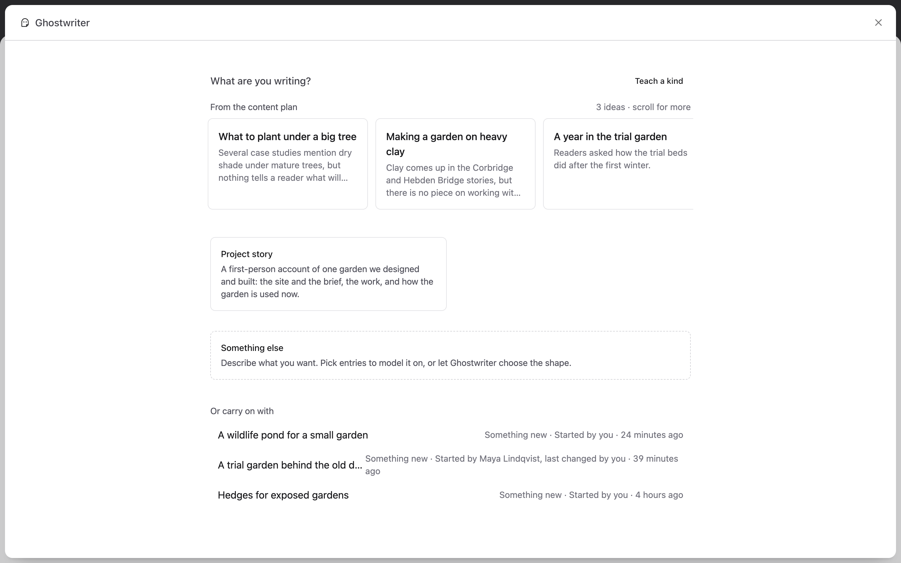

## The brief

There is no form to fill in. Once you've chosen what you're writing, the conversation opens and Ghostwriter asks for the quick details in one message: **"What’s it called, and what should it say? A line or two is plenty."** Reply with a working title and a few notes (the angle, who it's for, a point or two to make), and press **Send** or **⌘↵**.

From your reply Ghostwriter fills in the whole brief for that kind, with one model call, and shows it in the conversation as a **brief card**:

- **Working title**, then each of the kind's questions with its answer, all of them editable;
- **Model it on**, with the entries to follow ticked: a learned kind's own examples, or those of the kind you chose. With none of those, Ghostwriter ticks up to six published entries closest in purpose and shape to the new piece, best first. Change the ticks as you like (up to six); with none ticked, Ghostwriter goes by the brief and how this collection is usually written. **Try again** keeps what's ticked.

Anything only you know stays in `[square brackets]`, such as `[Add: the client and what changed after launch]`. Ghostwriter never makes up facts about your organisation, its projects or its figures: a figure or a quote you didn't give is left in brackets for you.

Change any answer in the card, then:

- **Looks right, start writing** stores the brief on the piece and starts writing. Anything still in brackets is fine: it becomes a gap in the draft, which [Finish this page](finish-this-page.md) picks up.
- **Try again** fills the brief in once more. The answers you changed are kept as you wrote them.

The card is a labelled region: a screen reader hears "The brief is filled in. Check it, then start writing." when it arrives, and the keyboard lands on it.

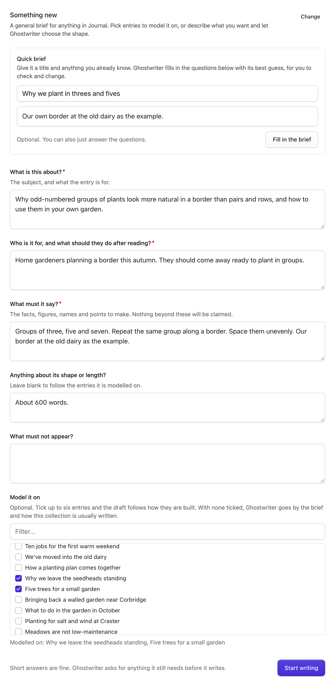

**Draft this** on an idea in the [content plan](content-plan.md) skips the question: the card arrives already filled in from the idea, ready to check.

If the brief can't be filled in, Ghostwriter says so with **Try again**; or reply with a little more about the piece and it fills the brief in from everything you've said.

> Ghostwriter uses only facts from the brief and the conversation for anything about your organisation. It doesn't invent figures, quotes or client names. Widely known facts about the subject itself it may state, and says so in its reply.

## The conversation

Ghostwriter writes on the first turn whenever it can. If it needs something only you know, it asks first: four short questions at most, headed **Ghostwriter needs your answer** and announced to screen readers. Each question has its own box, labelled with the question, with a hint under it when one helps; a question with a few set answers has radio buttons instead, and one it can do without is marked *(optional)*. **Skip** a question you can't answer: Ghostwriter writes around it or marks the place for you to fill in. **Add anything else** opens the reply box for anything more. **Send answers** (or ⌘↵ / Ctrl+↵ in any box, which never saves the entry) sends them all as one message, and **Just draft it with what you have** has it write now and mark the gaps. Once sent, the questions stay in the conversation with your answers under them.

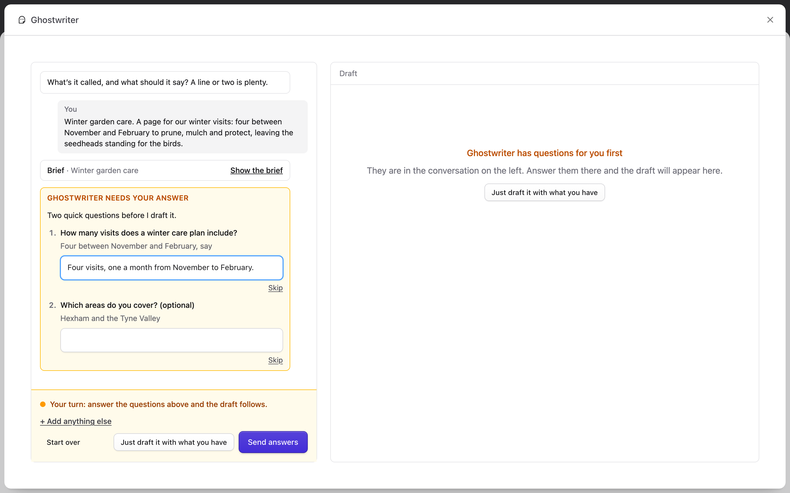

Once the writing has started, the brief card collapses to **Show the brief**. Open it to read or change the brief, then **Save the brief**: nothing is rewritten straight away, and Ghostwriter works from the new brief from your next message. A piece carried on later, or a colleague's shared conversation, shows the card in the same place.

Once there is a draft, ask for changes in plain words:

- "Make the opening shorter."
- "Add a section on cost, after the process."
- "Less formal."

Press **⌘↵** (or **Ctrl+↵**) to send. While it works, a line and a timer say what it is doing ("Filling in the brief…", "Reading the brief…", "Thinking it through…", "Writing. Long drafts take a while…"); a draft usually takes a minute or two. Replies are shown formatted, with their lists and bold. A reply that changed the draft ends with a line such as **Draft written · 286 words** or **Draft updated · 222 → 236 words (+14)**. With reduced motion on, the spinners and the pulsing dot stand still.

If a turn fails, see ["That didn't work"](troubleshooting.md#that-didnt-work).

## The draft

The draft sits on the right, under three tabs: **Preview**, **Blocks** and **Text**. Ghostwriter remembers your choice in this browser.

In a narrow window (a tablet or a phone), the conversation and the draft take turns: **Conversation** and **Draft** at the top switch between them. A dot on Draft means the draft has changed since you looked; a dot on Conversation means Ghostwriter is working, or (amber) waiting for your answer. The box for your message stays at the bottom of the conversation.

- **Preview** shows the draft as a page of your site, rendered with the site's own templates. It is the first tab once there is a draft, for new entries and for [edits](editing.md). See [The Preview tab](#the-preview-tab).
- **Blocks** lays the draft out the way the entry is built: its fields, and its page-builder blocks in order. **Text** shows just the words, read straight through.
- **Click any writing (or Tab to it) to change it.** It's saved when you leave it; **Esc** puts back what was there. **Enter** finishes a one-line field; in longer text it starts a new line. Rich text stays rich: bold, links and lists are kept.
- **In Text, gaps show as chips** (facts to add, counts to check, links to choose), as on the Preview tab, and a chip opens the same [box to deal with it](#the-preview-tab). Writing with a chip in it starts editing when you click its words, or Tab to it and press **Enter** (or start typing): then you see it exactly as it's kept, raw markers and all (`[[ask: adult ticket price]]`), and that is what's saved. Tab from the writing goes on to its chips.
- **Edit YAML** opens the whole draft as YAML, to add, move or remove blocks. Most people never need it.

The word count is at the top. Images are chosen on the entry's own fields once the draft is in the form; see [Images with a draft](images.md#images-with-a-draft).

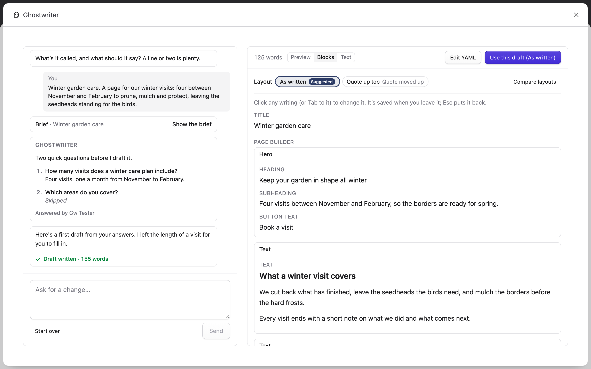

The panel follows the Control Panel's dark mode.

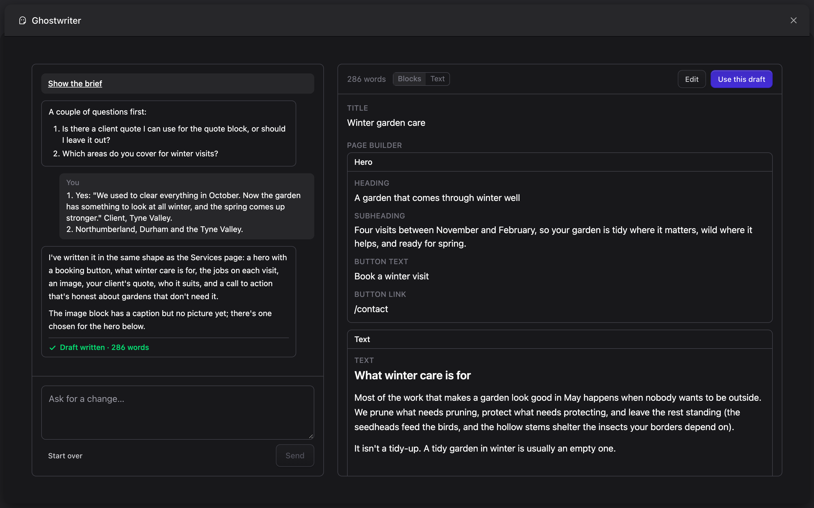

### The Preview tab

**Preview** renders the draft through your site's templates, exactly as **Use this draft** would fill the form, in a frame beside the conversation. The bar above the page shows its title and address, and **Preview · not saved**.

- **Nothing is saved.** No entry is created or changed, and no image is added to your assets: it uses Statamic's Live Preview, with the draft held only for the preview. Image placeholders and [stock previews](stock-photos.md) show as they would on the page.
- **Hover the page** to see its blocks: each is outlined with its name ("Hero", "Call to action"), and a set inside Bard or a section of rich text is outlined dashed, with the block it sits in ("Pull quote · in What the practice asked for").
- **One scrollbar.** The page is shown whole, as tall as it is: the draft's pane scrolls through the layouts and the page together, with no second scrollbar inside the page. A full-screen hero is shown as tall as the pane.
- **Desktop** and **Phone** switch the page's width. In a narrow panel, Desktop shows the full-width page scaled to fit.
- **It follows your changes.** After you change writing in Blocks or Text, use **Edit YAML**, choose an image or a [layout](#layouts), change an extra, or Ghostwriter revises the draft, the page renders again when you come back to Preview (or 0.8 seconds after the change while it's showing). The old page stays, dimmed, until the new one has loaded, at the same place on the page.
- **Gaps show as what they are**, not as raw text. A fact only you know (`[[ask: adult ticket price]]` in the draft) is an amber chip reading "adult ticket price", titled "Only you know this: add it before publishing". A [count to check](finish-this-page.md#counts-to-check) shows its number ("3 areas") with a dotted amber underline, titled "Counted from '…'. Check it before publishing". A link still to choose has a dashed amber underline, titled "Link to choose". Screen readers hear "Fact to add:", "Count to check:" and "(link to choose)". The layout cards' thumbnails show the same chips. Until you deal with them, the draft keeps the markers, and so does the entry once you use it, so [Finish this page](finish-this-page.md) finds them.
- **Click a chip (or Tab to it and press Enter) to deal with it here**, in the draft, before you use it. A small box opens at the chip:
  - a fact to add: "Only you know this: adult ticket price", with a box for your answer, **Add it** and **Leave it for later**. Your answer goes into the draft exactly as you type it: no model is asked, and nothing is reworded;
  - a count to check: "Counted from ‘Northumberland, Durham and the Tyne Valley’. 3 areas, is that right?", with **Looks right**, **Change it** and **Remove it**;
  - a link to choose: the page Ghostwriter suggested for it first, then the pages its hint suggests ("Link to About"), or **Choose an entry** to find one by its title. A link in the writing points at the page's address; a button's link field gets the entry.

  The preview, the layouts, Blocks and Text follow at once, and in a [shared conversation](#sharing-conversations) everyone sees the change. A gap dealt with here is gone from the draft, so Finish this page won't ask about it after **Use this draft**; one you leave for later still shows there. Esc closes the box and puts you back on the chip.
- **Links on the page do nothing**, so the preview never navigates away. Forms can't be sent, and third-party scripts (analytics, tag managers, chat widgets) don't run.
- **If the page can't render**, Preview says so in words ("The page template couldn't render this draft: …"), with **Show blocks instead** and **Try again**. Super users also see the error and the template. The draft itself is fine: **Blocks**, **Text** and **Use this draft** all still work, and the piece opens on Blocks next time in this browser tab. A page that takes longer than 8 seconds is given up on; if an earlier version is showing, it stays, with "This page is slow to render; showing the last version".
- **No Preview tab** means the collection has no pages on the site (no route), or the preview is switched off (`preview.enabled`).

The tabs are reachable by keyboard: Tab to the selected one, then the arrow keys move between them. The frame is titled for screen readers ("Preview of the draft: …"), and the outlines are visual only.

### Comments

Comment on the page itself and let Ghostwriter revise just those parts. Turn on **Comment** above the Preview (or press **Alt+Shift+C**). The amber count on the button is your comments not sent yet, plus those sent and not resolved.

- **Pin a comment**: click a block, or select some words in one, and write what should change in the small box that opens there. **⌘↵** (Ctrl+Enter) adds it; Esc cancels. Each comment gets a numbered amber pin on its block, or at the words.
- **Your comments are yours until you apply them.** They stay in this browser, even if you reload or close the panel. Click a pin, or use **Edit** and **Delete** in the list, to change one. **Comment on the whole page** adds one about the page as a whole.
- **Apply N comments** sends them together, as one message in the conversation ("4 comments", each with its block and words; click one to see it on the page). Ghostwriter makes **one** call and changes only the commented blocks. The layout stays unless a comment asks for a new one.
- **Ghostwriter answers with one message**, with a reply to each comment:
  - **Changed**: the block changed. The page shows it with a green **Changed** mark, which flashes once. **Before / after** shows the change word by word, and **Put it back** undoes it.
  - **Replied**: an answer with no change, for a question, an image, or something it would have had to invent.
  - **Not applied**: a check refused the change, and the reply says why ("That change needed something I don’t have (£75)…"). A fact you give in a comment ("it’s £60 a visit") may fill a gap, and is labelled as yours.
  - **Skipped**: someone changed that block while Ghostwriter worked, so nothing changed. Apply again to use the new version.
- **Resolve** a comment when you're done with it: its pin goes. **Reopen** brings it back.
- **Comments follow their words.** Switch layout and each pin moves to the block holding its words. If a layout leaves its words out, the comment says "Not in this layout". If a later message rewrites the words away, it says they've gone.
- **Shared conversations**: comments that have been sent are in the conversation, so everyone on the piece sees them and their answers. While the comments are on show, the panel checks for new ones every 10 seconds. One run at a time: while Ghostwriter applies comments, Send waits, and you can keep pinning new ones for next time.
- **Keyboard**: in comment mode, Tab reaches the blocks on the page. The arrow keys move between them, Enter opens the box, and **Alt+Shift+M** comments on words you've selected. The comments list beside (or under) the page has every action, including **Show on page**.

Adding, editing, resolving and putting back cost nothing. Only **Apply** asks the model, once, however many comments it carries (up to 12).

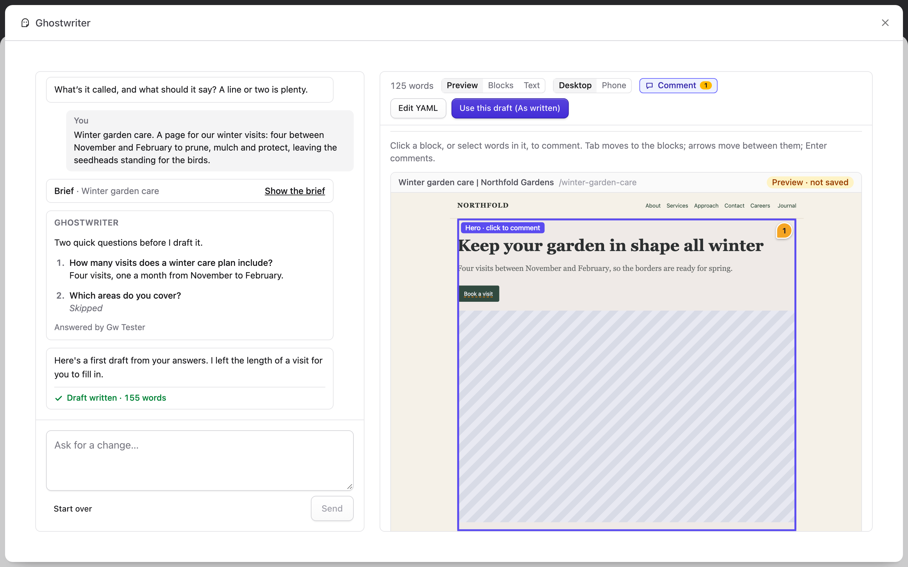

### Layouts

Ghostwriter doesn't just write the draft one way. Once the first draft is in, it looks for up to two other layouts of **the same words**, and shows them as cards above the draft under **Layout**:

- **The first card is the draft as written.** The others arrange the same text and the [extras](#extras) into your blocks differently: the numbers in a stats block near the top, say, or each section in a block of its own. A layout never adds or rewords a word; it only moves, splits and joins what is there, into blocks your blueprint has.
- **Each layout** has its name and what it changes. **Suggested** marks the one most like your collection's own pages. Under **Compare layouts** (below), each is a card with a live thumbnail of the page (rendered with your templates, starting where the layouts begin to differ), a line about it, and how many blocks it has. Without a Preview tab, or if the page can't render, a card lists its blocks instead.
- **Choose a layout** and Preview, Blocks and Text all show that layout, and the button becomes **Use this draft (Numbers first)**. Choosing costs nothing and changes nothing until you use the draft. The choice is kept with the piece, so in a [shared conversation](#sharing-conversations) everyone sees the same one.
- **While Ghostwriter is still looking**, the draft is already there with its own card, beside "Finding other layouts…". It takes one more short model call after the first draft, and none after that: asking for changes, editing the writing and choosing a layout all keep the layouts in step with the words without asking again.
- **"Needs refreshing"**: a change to the draft can leave a layout unable to hold it (a required heading taken out, say). That card can't be chosen, and the draft as written is used until you click **Refresh layouts**, which asks once for new ones.
- **Only layouts that look noticeably different are offered**: one that only sets a line as a quote, or turns a list into paragraphs, near the foot of the page is dropped before you see it, and so is one too like another on offer.
- One layout is all there is when the draft has little to arrange (a short piece, or no page builder and a single section of rich text), when nothing else fitted the blueprint, or when nothing else looked different enough. Then there is no **Layout** row, and the button is plain **Use this draft**.
- **Each layout says what it changes** against the draft as written, beside its name: "Quote moved up · Text blocks joined", "Closing line as a quote", "Call to action added".
- **Switching layout points at the change.** Once the new layout shows, the draft's pane scrolls to the first block it changes, and every changed block is outlined for about two seconds, in the Preview and in Blocks and Text. With reduced motion, the pane jumps there and the outline is still, then gone. Opening a piece doesn't do this; only switching does.

In Blocks and Text, writing that is still one piece of the draft can be clicked and changed as usual, in any layout. Writing a layout has moved or joined, and the extras, are changed in their own place: switch to the first card, or use the Extras list.

**The row stays small** so the Preview has the room: the layouts are a row of names, the chosen one marked and **Suggested** kept. **Compare layouts** shows the cards with their thumbnails, and **Hide thumbnails** puts the row back; your browser remembers which. Thumbnails only render while they show.

The layouts are a radio group: Tab to the chosen one, and the arrow keys move between them and choose. Each is announced with its name, whether it's suggested, its blocks, what it changes and its description. In a narrow panel the row wraps, and the cards scroll sideways.

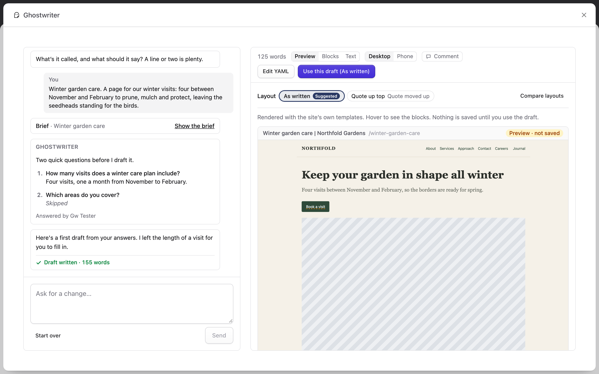

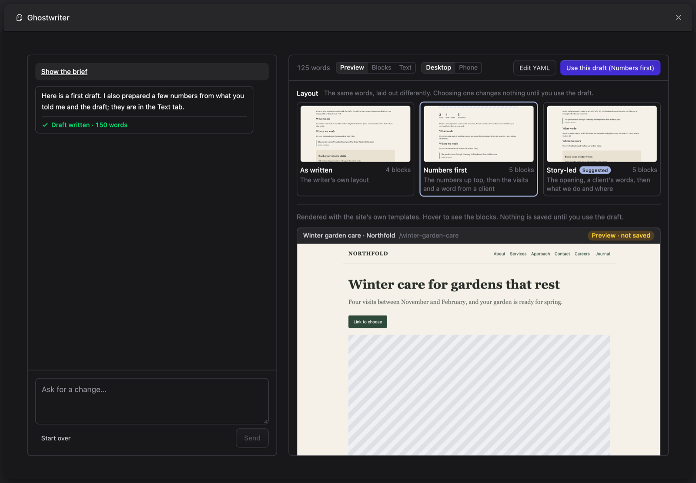

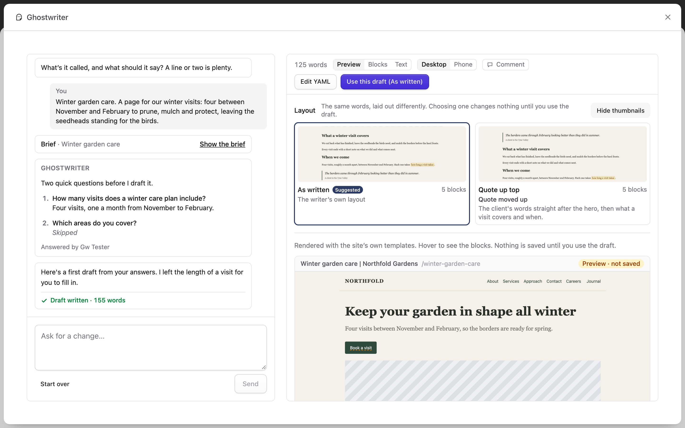

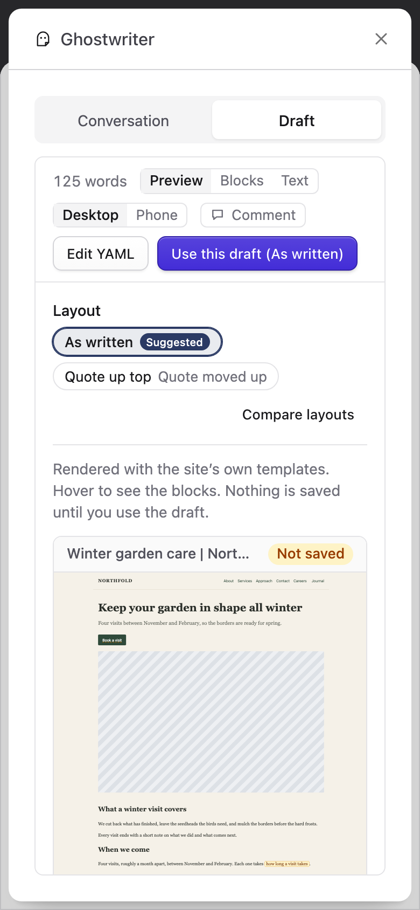

### Extras

With the draft, Ghostwriter prepares **extras** for the kinds of block your blueprint has: stats, FAQs, a pull quote, an "at a glance" box, captions, a second call to action, a testimonial or a short intro. They're under **Extras** at the end of the **Text** tab: "Prepared with the draft, only from what you told me, the draft itself or your existing pages."

- **Every fact in an extra has a source**, shown beside it: *from your answer · question 2*, *from your brief*, *from the draft*, or *from About* (linked to that entry). Something it would need and doesn't have is left as a gap (*Needs your answer*), never made up. One you change says *your words*.
- **A number Ghostwriter counted** from a list you gave ("3 areas" for "Northumberland, Durham and the Tyne Valley") says so ("Counted from your answer: …") and is marked **Needs review**. Ghostwriter counts the list itself; the model only points at it. On the form, [Finish this page](finish-this-page.md#counts-to-check) asks you to check it before the page goes live.
- **A layout uses an extra where it has room**: each extra says whether the chosen layout uses it ("Used in Numbers first"). One that no layout uses never reaches the entry.
- **A fact to add or a count to check shows as a chip**, as on the Preview tab, and clicking the chip opens the same box to answer or check it there. Click the words around it (or Tab to them and press Enter) to change them, and you'll see them as they're kept, markers included (`[[ask: years trading]]`).
- **Click any part to change it** (a stat is its number and its label), as with the draft. **✕** deletes an item, and a layout that used it carries on without it. Neither asks the model anything.

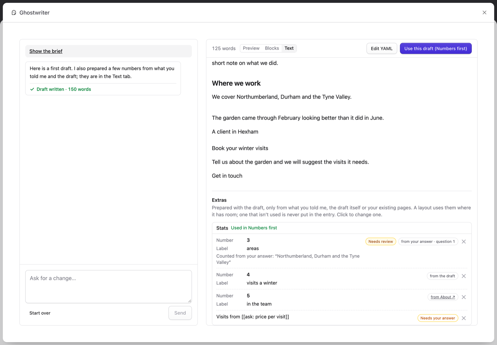

### The preview, for site developers

The preview is a Live Preview request, so everything that already treats Live Preview differently does here too: `{{ live_preview }}` is true, static caching and the `{{ cache }}` tag are skipped, and drafts render. To tell a Ghostwriter preview apart from Statamic's own, use `{{ live_preview:ghostwriter }}`:

```antlers
{{ unless live_preview }}
    {{ partial:analytics }}
{{ /unless }}

{{ if live_preview:ghostwriter }}
    {{# A draft from Ghostwriter: no comments widget, no view counter #}}
{{ /if }}
```

- **Third-party scripts are blocked** on Ghostwriter's preview pages by a Content-Security-Policy (`script-src 'self' 'unsafe-inline' 'unsafe-eval'; connect-src 'self'; form-action 'none'; frame-ancestors 'self'; base-uri 'self'`), added beside any policy your site or Statamic (on multisite) already sends: the stricter rule wins. If your own scripts come from a CDN, allow it with `preview.script_hosts` (`GHOSTWRITER_PREVIEW_SCRIPT_HOSTS=https://cdn.example.com`).
- **The entry may never have been saved.** Its id starts `gw-preview-`, and `{{ collection:next }}`, `previous`, `older` and `newer` work for it. In a structured collection its URL is the one it will have: under the parent chosen in the form, or at the top.
- **The text carries invisible markers** (Unicode tag characters at the end of each value) that the panel reads and removes as soon as the page loads, to match the page to the draft's blocks. They don't change how the text looks, or what filters such as `title`, `upper` or `widont` do. A filter that cuts text short (`truncate`) may cut one off; that block is then found by its words instead.
- **Chrome warns** in the console that a frame with `allow-scripts` and `allow-same-origin` "can escape its sandboxing". That is expected: the frame is your own site, as in Statamic's Live Preview, and the policy above keeps it to your own scripts.
- **The frame must be allowed on the same origin.** If your web server sends `X-Frame-Options: DENY` or `frame-ancestors 'none'` for every page, the preview (and Statamic's Live Preview) can't show; allow `SAMEORIGIN`.

### Headings

Ghostwriter fits every draft's headings to the page, with no setting:

- **The body starts below the page's main heading.** Most templates print the entry's title as the H1, so a draft's sections start at H2. The Preview tab reads which headings the template prints each time it renders a draft, and keeps that per collection and blueprint; if your template prints the H1 from another field, or none, later drafts follow it once two previews agree.
- **Only the levels a Bard field's buttons offer.** A field with H2 and H3 buttons never gets an H4: a deeper heading becomes a bold lead-in ("**Heading.** Its paragraph"). A field with no heading buttons gets no headings.
- **No skipped levels**, no empty headings, and a bold line used as a heading becomes a real one. Words are never changed.

A template that prints no H1, a logo as the H1, or more than one, is listed for super admins on the Ghostwriter Overview. Ghostwriter still starts the text at H2; the fix belongs in the template.

### Links to your other pages

A first draft is linked to a few of your site's other pages, as an editor would, with no setting:

- **While it looks**, the draft is already there to read, and the draft's pane says "Draft ready. Checking headings and links…". **Use this draft**, **Edit YAML**, the layouts and clicking to change the writing wait until it's done, so the words never change under you. It usually takes a few seconds.
- **About one link per 250 words**, two to five on a page, on words that already say what the other page is about. The words are never changed to make room for a link. Then a second call checks each link and drops any that doesn't earn its place.
- **The conversation says what it did**, under the first draft: "I linked to 2 of your pages: How a planting plan comes together, Contact."
- **In the Text and Blocks tabs, each link Ghostwriter added has a dotted underline and a small mark.** Hover it, Tab to it or click it to see the page it goes to (its title, type and address) and why, with **Open page** and **Remove link**. Removing a link keeps the words, and Ghostwriter won't put it back.
- **Every layout keeps the links**, and they go into the form with **Use this draft** as ordinary links to entries (`statamic://entry::…`), so they follow the page if its address changes.
- **After Use this draft**, [Finish this page](finish-this-page.md#links-ghostwriter-added) asks you to check them, as a suggestion that never counts as unfinished.
- **The writer's own links** to a real, published page of the site are kept as it wrote them. A link it couldn't place stays a [link to choose](finish-this-page.md#the-markers), and Ghostwriter suggests the page it most likely means: [Finish this page](finish-this-page.md#the-guide) and the chip's box offer that page first, for you to choose. It's never put in for you.

**Which pages can be linked to.** Any page of the same site with an address: every collection with a route, not only those Ghostwriter writes for, and taxonomy terms with a page of their own and some text on it. Drafts, scheduled and expired entries, redirects, pages marked noindex (in SEO Pro or with a noindex toggle), the home page and utility pages (search, log in, basket, thank you and the like) are left out, and so is the page itself. Ghostwriter keeps a list of these pages, beside the sessions, kept current when an entry or term is saved or deleted and by the daily pass (see [Content to revisit](suggest-edits.md#keeping-it-current)). It keeps up to 5,000 pages a collection, the key pages first (those in a navigation or at the top of a structured collection), then the newest; a super admin sees a note on the Overview when a collection has more.

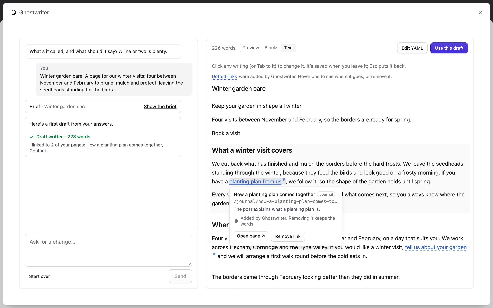

### Search

Under the Extras at the end of the **Text** tab, **Search** shows how the page may appear in search results, as **Use this draft** will put it in. Nothing here is saved until you use the draft.

- **SEO title.** Most pages keep using the page title, which is what SEO Pro does by default: the row says "Uses the page title: “…”", with its length against the field's limit and why ("It fits, so your SEO settings keep using it."). When the page title is too long for search results once your site name is added, the first draft gets a shorter title of its own. **Give it its own** gives the page one anyway, starting from the page title; **Use the page title** goes back.
- **Meta description.** The first draft's SEO check writes one or two plain sentences from what the page says, and nothing it doesn't say: no figure, name or quotation the draft, your brief and your answers don't have. The count (`149 / 160`) turns amber outside the range search results show well (120 to 155 characters for a limit of 160; its tooltip says so). If the description couldn't be written from the page, the row says so and stays empty.
- **Address.** On a new entry, or one not yet published, the slug is made from the title, keeping the whole phrase, as people search for it: "What to do in the garden in March" becomes `what-to-do-in-the-garden-in-march`. Only a long title (over about 60 characters) loses its little words ("the", "for", "in") and is cut to six words. A leading "the" or a trailing "for" comes off either way, a year stays only in a dated collection such as a journal, and the slug is unique in the collection and site. It follows the title until you change it. A published entry keeps its address, shown greyed with "Published pages keep their address". Only collections whose route uses the slug show it.
- **Click any of them to change it**, as with the draft: saved when you leave it, Esc puts it back, and no model is asked. What you write is yours: a later turn won't rewrite it.
- **Try again** asks for another title and description, written differently (one call; "Asks for another title and description. Uses Ghostwriter."). It says "Writing another…" meanwhile, and if the call fails, "That didn't work. Try again in a moment."
- **Later turns.** When you ask for changes that alter the title or about a quarter of the words, the title and description are written again (one call), unless you edited them.

**Which fields are filled.** SEO Pro's title and description (the injected `seo` field), else plain fields named `seo_title`, `meta_title`, `seo_description` or `meta_description`, with the field's character limit. Ghostwriter never writes over a person's text:

| The field holds | On Use this draft |
| --- | --- |
| Nothing | The draft's text goes in |
| Text Ghostwriter put in before, unchanged since | The draft's text goes in |
| Text someone wrote | Kept. The Search section says "Your SEO description stays. Suggested instead: …", with **Use this** to put the draft's in after all (and **Keep mine** to change your mind) |
| Text from another field, through SEO Pro (`@seo:excerpt`), that fits | Left as your site set it up |
| Text from another field that's empty, or a field the blueprint doesn't have (`@seo:excerpt` on Pages, which has no excerpt) | Written, as if the description were empty: the page prints nothing. The row says "It came from Excerpt, which is empty, so this page gets its own." |
| Text from another field that's empty, or too long or short | Kept, with the draft's suggested |
| A template, or switched off in SEO Pro | Left alone |

In SEO Pro, the text goes in as the entry's own (custom) value, and the field's other settings stay as they were. With no SEO fields on the blueprint, only the address shows; with neither, there's no Search section. After **Use this draft**, [Finish this page](finish-this-page.md#a-description-for-search) offers the draft's description where the entry's own is empty or too short.

## Use this draft

**Use this draft** puts the draft into the entry form underneath, field by field, in the [layout](#layouts) you chose (the button names it). Anything the draft doesn't cover keeps what was in the form.

- **Nothing is saved or published.** Check the form over, then save as you normally would.
- **Drafts start unpublished.** On a new entry, or one that isn't published yet, the form's **Published** toggle is switched off, so you can save straight away and the entry goes live only when you switch it on. The message says "Ghostwriter drafts start unpublished. Switch on Published when you're ready." An entry that is already published keeps its toggle as it is. To leave the toggle alone everywhere, set `drafts_unpublished` to `false` in `config/ghostwriter.php` (or `GHOSTWRITER_DRAFTS_UNPUBLISHED=false`).
- **The search title, description and address** from the [Search](#search) section go into the SEO fields and Statamic's own **Slug** field, under the rules above: never over a person's text, and the address only on an entry not yet published whose slug is empty or still the one Statamic made from the title.
- Using it again replaces the fields it covers.

When the draft leaves something only you can finish (a fact it didn't have, a link to choose, an image placeholder), [Finish this page](finish-this-page.md) takes over: the count appears on the Ghostwriter menu, beside **Write with Ghostwriter**, the fields are highlighted, and the guide opens on the first gap. Anything else worth knowing is listed in one notice above the form, under "Draft added to the form. Check it over, then save.", until you close it, such as fields and blocks the draft used that this blueprint doesn't have, and options that don't exist, which were left out. Without either, a short message says the draft went in.

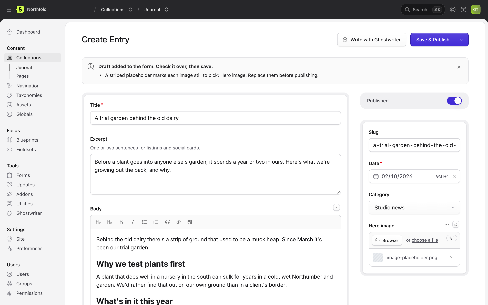

## Carrying on later

The conversation is saved, and the panel carries on with the piece you were on:

- **On the same screen**, after **Use this draft** or closing the panel, **Write with Ghostwriter** opens the same piece again.
- **Reloading the page** opens it too: the address names the piece (`?ghostwriter=…`).
- **Later**, open it from **In progress** on the Overview, **Or carry on with** in the panel, or **Resume** on the content plan. A draft put into the form but not saved stays in all three.

**Start over** goes back to **What are you writing?** for a new piece. The earlier conversation isn't deleted; it stays on the Overview until it is removed.

A piece leaves **In progress** once its entry has been saved. Putting the draft into the form isn't enough.

## Sharing conversations

With Statamic Pro and more than one user, conversations are shared with everyone who may use Ghostwriter, so a colleague can pick a piece up where you left it. Each message shows who sent it, and the brief card is in the thread. See [Shared conversations](permissions.md#shared-conversations).

Next: [Editing an existing entry](editing.md).
